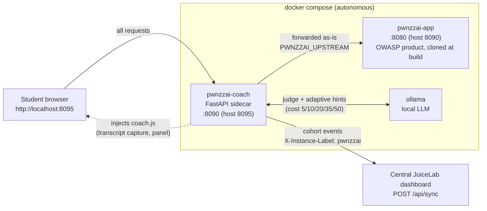

# JuiceLab Coach for PwnzzAI

A pedagogical **sidecar** that turns OWASP [PwnzzAI](https://github.com/OWASP/PwnzzAI)
into a guided, cohort-tracked lab — **without modifying a single line of the
OWASP product**. It sits in front of PwnzzAI as a transparent reverse proxy
and injects a coach panel into the student's browser.

This repository follows the **JuiceLab model**: it contains *only* the
pedagogical overlay. PwnzzAI itself is **never vendored** — it is cloned at a
pinned upstream commit at build time (`coach/Dockerfile.pwnzzai`). No OWASP
code, no OWASP history, no OWASP secrets live here.

It brings the four reframes of the JuiceLab approach to PwnzzAI:

| # | Reframe | How it works here |
|---|---------|-------------------|
| 1 | **LLM-as-judge** | A second Ollama call reads the attack transcript and decides if the lab objective was actually reached, with a 0-100 quality score. Detection becomes automatic *and* qualitative. |
| 2 | **No fork, sidecar** | A reverse proxy in front of PwnzzAI. The OWASP image is untouched, so upstream updates never break the coach. |
| 3 | **Transcript capture** | `coach.js` monkey-patches `fetch`/`XHR` in the browser and records every student↔assistant exchange — lab-agnostic, no per-lab parsing. |
| 4 | **Adaptive hints** | The local LLM looks at the student's *failed* attempts and nudges them, graded over 3 levels, in FR or EN. |

Events (`session_start`, `hint_revealed`, `challenge_solved`,
`journal_filled`) are pushed to the **JuiceLab teacher dashboard** using its
public `POST /api/sync` contract, so a PwnzzAI cohort shows up in the same
teacher matrix as Juice Shop.

## Architecture

The coach is a **transparent reverse proxy** (`pwnzzai-coach`, FastAPI) placed
in front of the untouched OWASP product (`pwnzzai-app`). Every student request
flows through the coach, which forwards it as-is to the upstream and injects a
single `coach.js` `<script>` into the returned HTML. The coach talks to a local
`ollama` for the LLM-as-judge and adaptive hints, and reports cohort events to
the **central JuiceLab teacher dashboard** — the same shared instance Juice Shop
students report to. The dashboard server is never vendored here; PwnzzAI is only
a client.



The coach needs no knowledge of PwnzzAI's internal routes, so upstream updates
never break it — bump `PWNZZAI_COMMIT` and rebuild. Full internals:
[docs/ARCHITECTURE.md](./docs/ARCHITECTURE.md).

## Run

This stack is **self-contained** — no PwnzzAI checkout needed:

```bash
cp .env.example .env        # then edit cohort/dashboard settings
docker compose up -d --build
```

- Coached entrypoint for students: **http://localhost:8095**
- Raw PwnzzAI (debug, bypasses the coach): http://localhost:8090

Pull the models (once):

```bash
docker exec ollama ollama pull llama3.2:1b   # lab assistant
docker exec ollama ollama pull llama3.2:3b   # judge (1b is unreliable)
```

Check health:

```bash
curl -s http://localhost:8095/__coach/health
# {"ok":true,"ollama":true,"dashboard_configured":true}
```

## Cohort wiring

Set in `.env`:

| Variable | Meaning |
|---|---|
| `JUICELAB_DASHBOARD_URL` | Dashboard URL **as seen from the container**. Same machine → `http://host.docker.internal:5000`. Empty → local mode, no reporting. |
| `JUICELAB_COHORT_ID` | Cohort grouping students in the dashboard. |
| `JUICELAB_INSTANCE_LABEL` | This machine's name in the teacher matrix (`X-Instance-Label`). |
| `COACH_JUDGE_MODEL` | Judge/hint model (e.g. `llama3.2:3b`, `mistral:7b`). |
| `PWNZZAI_COMMIT` | Pinned OWASP commit cloned at build. Bump to track upstream. |

The dashboard auto-registers an unknown `(cohort, token)` pair as `validated`
on the first event — no pre-enrolment needed. The student token is a UUID
generated in the browser and kept in `localStorage` (`pwnzzai_coach_v1`).

### Dashboard prof (central, partage)

Le dashboard prof se deploie **une seule fois** et sert juicelab ET PwnzzAI.
PwnzzAI n'embarque pas le serveur : il pointe dessus via `JUICELAB_DASHBOARD_URL`.

Si tu veux le deployer depuis cette machine (sans cloner le code eleve juice) :

```bash
scripts/deploy-dashboard.sh
```

Cela tire uniquement la partie prof (dashboard + docker) du repo juicelab a la
ref `JUICELAB_DASHBOARD_REF`, puis lance le compose dashboard-only. Renseigne
les secrets dans le `.env` genere (`DASHBOARD_TEACHER_TOKEN`,
`DASHBOARD_PROOF_SECRET`, >= 16 caracteres) puis relance.

Anti-pattern : ne deploie pas un second dashboard. Une instance, deux clients.

## Endpoints (coach API)

| Method | Path | Purpose |
|---|---|---|
| GET | `/__coach/config` | cohort + labs (briefing concepts, quiz count) + hint cost cohort |
| GET | `/__coach/health` | coach / ollama / dashboard status |
| GET | `/__coach/quiz/questions?lab_key=…` | quiz questions (correct answers stripped) |
| POST | `/__coach/quiz/score` | `{lab_key, answers, lang}` → `{score, by_question}` |
| POST | `/__coach/hint` | `{lab_key, level, lang, transcript}` → graded hint (N1-N5) + cost |
| POST | `/__coach/judge` | `{lab_key, transcript}` → `{success, score, reason}` |
| POST | `/__coach/event` | forward an event to the dashboard |
| GET | `/__coach/static/*` | `coach-i18n.js`, `coach-state.js`, `coach-api.js`, `coach.js`, `coach.css` |

## Labs

The catalogue lives in [`coach/labs.json`](./coach/labs.json) — one entry per
PwnzzAI lab page (path, OWASP LLM category, objective, judge success criteria,
hint context). Add or tune labs there; nothing else needs to change.

## Documentation

Bilingual, plus a distributable Word guide (same template as the JuiceLab docs):

| Document | Audience |
|---|---|
| [docs/GUIDE-FR.md](./docs/GUIDE-FR.md) | Guide complet (FR) — prof + élève |
| [docs/GUIDE-EN.md](./docs/GUIDE-EN.md) | Full guide (EN) — teacher + student |
| [docs/ARCHITECTURE.md](./docs/ARCHITECTURE.md) | Internals, protocol, Mermaid diagrams |
| docs/GUIDE-COACH-PWNZZAI.docx | Printable Word guide (embedded diagrams) |

Regenerate the `.docx`:

```bash
cd docs && npm install @mermaid-js/mermaid-cli   # once
python3 build_coach_guide.py
```

## Why this survives upstream changes

The proxy needs no knowledge of PwnzzAI's internal routes: it forwards
everything and only injects a `<script>` tag. Transcript capture is generic
(any `fetch`/`XHR` POST carrying a text field). When OWASP ships a new version,
bump `PWNZZAI_COMMIT` and rebuild; only `coach/labs.json` may need a path
update for lab *detection*.

## License

The coach overlay is released under the MIT License. OWASP PwnzzAI is the
property of its authors and is fetched from upstream at build time under its
own license.
