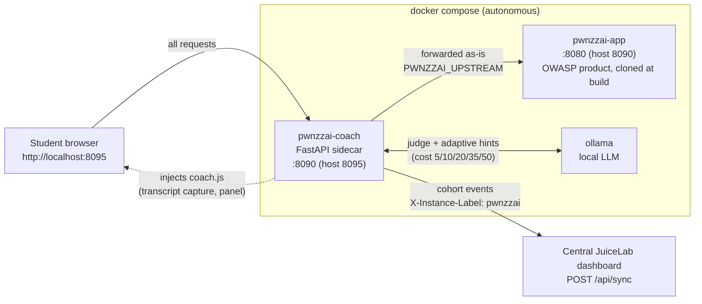

# JuiceLab Coach for PwnzzAI

🇫🇷 Français : [README_FR.md](./README_FR.md)

A pedagogical **sidecar** that turns OWASP [PwnzzAI](https://github.com/OWASP/PwnzzAI)
into a guided, cohort-tracked lab — **without modifying a single line of the
OWASP product**. It sits in front of PwnzzAI as a transparent reverse proxy
and injects a coach panel into the student's browser.

This repository follows the **JuiceLab model**: it contains *only* the
pedagogical overlay. PwnzzAI itself is **never vendored** — it is cloned at a
pinned upstream commit at build time (`coach/Dockerfile.pwnzzai`). No OWASP
code, no OWASP history, no OWASP secrets live here.

It brings the four reframes of the JuiceLab approach to PwnzzAI:

| # | Reframe | How it works here |
|---|---------|-------------------|
| 1 | **LLM-as-judge** | A second Ollama call reads the attack transcript and decides if the lab objective was actually reached, with a 0-100 quality score. Detection becomes automatic *and* qualitative. |
| 2 | **No fork, sidecar** | A reverse proxy in front of PwnzzAI. The OWASP image is untouched, so upstream updates never break the coach. |
| 3 | **Transcript capture** | `coach.js` monkey-patches `fetch`/`XHR` in the browser and records every student↔assistant exchange — lab-agnostic, no per-lab parsing. |
| 4 | **Adaptive hints** | The local LLM looks at the student's *failed* attempts and nudges them, graded over 3 levels, in FR or EN. |

Events (`session_start`, `hint_revealed`, `challenge_solved`,
`journal_filled`) are pushed to the **JuiceLab teacher dashboard** using its
public `POST /api/sync` contract, so a PwnzzAI cohort shows up in the same
teacher matrix as Juice Shop.

## Architecture

The coach is a **transparent reverse proxy** (`pwnzzai-coach`, FastAPI) placed
in front of the untouched OWASP product (`pwnzzai-app`). Every student request
flows through the coach, which forwards it as-is to the upstream and injects a
single `coach.js` `<script>` into the returned HTML. The coach talks to a local
`ollama` for the LLM-as-judge and adaptive hints, and reports cohort events to
the **central JuiceLab teacher dashboard** — the same shared instance Juice Shop
students report to. The dashboard server is never vendored here; PwnzzAI is only
a client.



The coach needs no knowledge of PwnzzAI's internal routes, so upstream updates
never break it — bump `PWNZZAI_COMMIT` and rebuild. Full internals:
[docs/ARCHITECTURE-EN.md](./docs/ARCHITECTURE-EN.md).

## Screenshots

Student side, the JuiceLab Coach panel injected by the sidecar into the PwnzzAI app (progression, badges, cohort join):


PwnzzAI cohorts report to the same central JuiceLab teacher dashboard. Teacher view of a cohort matrix (light theme; a light/dark toggle sits in the topbar):


Same matrix in dark theme:


## Run

This stack is **self-contained** — no PwnzzAI checkout needed:

```bash
cp .env.example .env        # then edit cohort/dashboard settings
docker compose up -d --build
```

- Coached entrypoint for students: **http://localhost:8095**
- Raw PwnzzAI (debug, bypasses the coach): http://localhost:8090

Pull the models (once):

```bash
docker exec ollama ollama pull llama3.2:1b   # lab assistant
docker exec ollama ollama pull llama3.2:3b   # judge (1b is unreliable)
```

Check health:

```bash
curl -s http://localhost:8095/__coach/health
# {"ok":true,"ollama":true,"dashboard_configured":true}
```

> Detailed install (one-command, Windows included): [INSTALL.md](./INSTALL.md) ·
> step-by-step student guides: [docs/STUDENT-INSTALL-EN.md](./docs/STUDENT-INSTALL-EN.md).

## Configure an LLM provider (target)

The OWASP product is built on **LiteLLM**, so the *target* assistant can run on
many providers with **zero code change** — pure `.env` config. Default is local
Ollama (offline). `MODEL_PROVIDER=openai` means **"cloud via LiteLLM"** (not
literally OpenAI); the prefix before `/` in `LITELLM_MODEL` selects the real
provider.

| Provider | `MODEL_PROVIDER` | `LITELLM_MODEL` (example) | Key var |
|---|---|---|---|
| Ollama (local, default) | `ollama` | — (uses `OLLAMA_MODEL`) | — |
| Groq | `openai` | `groq/openai/gpt-oss-20b` | `GROQ_API_KEY` |
| OpenAI | `openai` | `openai/gpt-4o-mini` | `OPENAI_API_KEY` |
| Google Gemini | `openai` | `gemini/gemini-2.0-flash` | `GEMINI_API_KEY` |
| Anthropic | `openai` | `anthropic/claude-3-5-haiku-latest` | `ANTHROPIC_API_KEY` |

To switch the target to a cloud provider (e.g. Groq):

1. In `.env`, set `MODEL_PROVIDER=openai` and `LITELLM_MODEL=groq/openai/gpt-oss-20b`.
2. Add your key: `GROQ_API_KEY=gsk_…` (goes in `.env`, which is gitignored — never commit it).
3. Restart: `./pwnzzai.sh restart`.

Only the `openai_*` cloud labs use this; `ollama_*` labs always use local Ollama
(keep the `ollama` service running). This needs **no modification of the OWASP
product** (LiteLLM) and survives upstream updates (pinned commit). See
[INSTALL.md](./INSTALL.md) for the full walkthrough and the Groq cost note.

## Cohort wiring

Set in `.env`:

| Variable | Meaning |
|---|---|
| `JUICELAB_DASHBOARD_URL` | Dashboard URL **as seen from the container**. Same machine → `http://host.docker.internal:5000`. Empty → local mode, no reporting. |
| `JUICELAB_COHORT_ID` | Cohort grouping students in the dashboard. |
| `JUICELAB_INSTANCE_LABEL` | This machine's name in the teacher matrix (`X-Instance-Label`). |
| `COACH_JUDGE_MODEL` | Judge/hint model (e.g. `llama3.2:3b`, `mistral:7b`). |
| `PWNZZAI_COMMIT` | Pinned OWASP commit cloned at build. Bump to track upstream. |

The dashboard auto-registers an unknown `(cohort, token)` pair as `validated`
on the first event — no pre-enrolment needed. The student token is a UUID
generated in the browser and kept in `localStorage` (`pwnzzai_coach_v1`).

### Dashboard prof (central, partage)

Le dashboard prof se deploie **une seule fois** et sert juicelab ET PwnzzAI.
PwnzzAI n'embarque pas le serveur : il pointe dessus via `JUICELAB_DASHBOARD_URL`.

Si tu veux le deployer depuis cette machine (sans cloner le code eleve juice) :

```bash
scripts/deploy-dashboard.sh
```

Cela tire uniquement la partie prof (dashboard + docker) du repo juicelab a la
ref `JUICELAB_DASHBOARD_REF`, puis lance le compose dashboard-only. Renseigne
les secrets dans le `.env` genere (`DASHBOARD_TEACHER_TOKEN`,
`DASHBOARD_PROOF_SECRET`, >= 16 caracteres) puis relance.

Anti-pattern : ne deploie pas un second dashboard. Une instance, deux clients.

## Endpoints (coach API)

| Method | Path | Purpose |
|---|---|---|
| GET | `/__coach/config` | cohort + labs (briefing concepts, quiz count) + hint cost cohort |
| GET | `/__coach/health` | coach / ollama / dashboard status |
| GET | `/__coach/quiz/questions?lab_key=…` | quiz questions (correct answers stripped) |
| POST | `/__coach/quiz/score` | `{lab_key, answers, lang}` → `{score, by_question}` |
| POST | `/__coach/hint` | `{lab_key, level, lang, transcript}` → graded hint (N1-N5) + cost |
| POST | `/__coach/judge` | `{lab_key, transcript}` → `{success, score, reason}` |
| POST | `/__coach/event` | forward an event to the dashboard |
| GET | `/__coach/static/*` | `coach-i18n.js`, `coach-state.js`, `coach-api.js`, `coach.js`, `coach.css` |

## Labs

The catalogue lives in [`coach/labs.json`](./coach/labs.json) — one entry per
PwnzzAI lab page (path, OWASP LLM category, objective, judge success criteria,
hint context). Add or tune labs there; nothing else needs to change.

## Documentation

Bilingual (EN/FR), plus distributable Word guides (same template as the JuiceLab
docs). 🇫🇷 The French index is in [README_FR.md](./README_FR.md).

**Quick start / scripts**

| Script | Audience | Purpose |
|---|---|---|
| [`pwnzzai.sh`](./pwnzzai.sh) / [`pwnzzai.ps1`](./pwnzzai.ps1) | everyone | launcher (`up`/`down`/`restart`/`status`/`logs`/`health`/`models`/`wipe`) |
| [`scripts/install-student.sh`](./scripts/install-student.sh) / [`.ps1`](./scripts/install-student.ps1) | student | one-command install (solo or cohort; never installs the dashboard) |
| [`scripts/deploy-dashboard.sh`](./scripts/deploy-dashboard.sh) / [`.ps1`](./scripts/deploy-dashboard.ps1) | teacher | deploy the central dashboard once (sparse checkout) |

Full install reference: [INSTALL.md](./INSTALL.md) (FR: [INSTALL_FR.md](./INSTALL_FR.md)).

**Guides**

| Document | Audience |
|---|---|
| [docs/STUDENT-INSTALL-EN.md](./docs/STUDENT-INSTALL-EN.md) | Student install walkthrough (EN, Windows incl.) — FR: [STUDENT-INSTALL-FR.md](./docs/STUDENT-INSTALL-FR.md) |
| [INSTALL.md](./INSTALL.md) | Install reference (EN) — FR: [INSTALL_FR.md](./INSTALL_FR.md) |
| [docs/GUIDE-EN.md](./docs/GUIDE-EN.md) | Full guide (EN) — teacher + student — FR: [GUIDE-FR.md](./docs/GUIDE-FR.md) |
| [docs/ARCHITECTURE-EN.md](./docs/ARCHITECTURE-EN.md) | Internals, protocol, Mermaid diagrams (EN) — FR: [ARCHITECTURE.md](./docs/ARCHITECTURE.md) |
| [docs/CORRECTIONS-CHALLENGES-EN.md](./docs/CORRECTIONS-CHALLENGES-EN.md) | Tested challenge corrections, from the UI (EN) — FR: [CORRECTIONS-CHALLENGES-FR.md](./docs/CORRECTIONS-CHALLENGES-FR.md) |
| [docs/COMMUNICATION-STUDENTS-EN.md](./docs/COMMUNICATION-STUDENTS-EN.md) | Ready-to-share student message: corrections + Groq option (EN) — FR: [COMMUNICATION-ELEVES.md](./docs/COMMUNICATION-ELEVES.md) |
| docs/GUIDE-INSTALL-ELEVE.docx | Printable Word install guide — **student** (FR) — EN: docs/GUIDE-INSTALL-STUDENT-EN.docx |
| docs/GUIDE-INSTALL-PROF.docx | Printable Word install guide — **teacher** (FR) — EN: docs/GUIDE-INSTALL-PROF-EN.docx |
| docs/GUIDE-COACH-PWNZZAI.docx | Combined printable Word guide (FR) — EN: docs/GUIDE-COACH-PWNZZAI-EN.docx |

Regenerate the install `.docx` (needs `python3.11` + `python-docx`; the
default `python3` here is 3.13 without `python-docx`):

```bash
cd docs && npm install @mermaid-js/mermaid-cli   # once, for the diagrams (mmdc)
python3.11 build_eleve_guide_fr.py               # -> GUIDE-INSTALL-ELEVE.docx (FR)
python3.11 build_eleve_guide_en.py               # -> GUIDE-INSTALL-STUDENT-EN.docx (EN)
python3.11 build_install_guides.py               # -> GUIDE-INSTALL-PROF.docx (FR)
python3.11 build_install_guides_en.py            # -> GUIDE-INSTALL-PROF-EN.docx (EN)
```

Regenerate the combined coach `.docx`:

```bash
cd docs
python3.11 build_coach_guide.py                  # -> GUIDE-COACH-PWNZZAI.docx (FR)
python3.11 build_coach_guide_en.py               # -> GUIDE-COACH-PWNZZAI-EN.docx (EN)
```

## Why this survives upstream changes

The proxy needs no knowledge of PwnzzAI's internal routes: it forwards
everything and only injects a `<script>` tag. Transcript capture is generic
(any `fetch`/`XHR` POST carrying a text field). When OWASP ships a new version,
bump `PWNZZAI_COMMIT` and rebuild; only `coach/labs.json` may need a path
update for lab *detection*.

## License

The coach overlay is released under the MIT License. OWASP PwnzzAI is the
property of its authors and is fetched from upstream at build time under its
own license.
