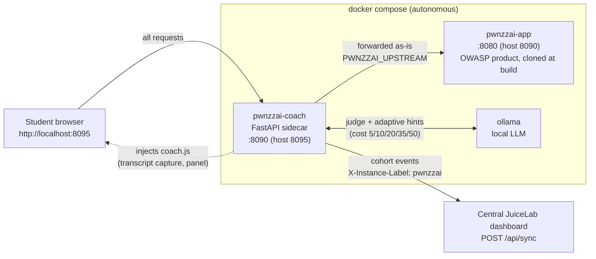
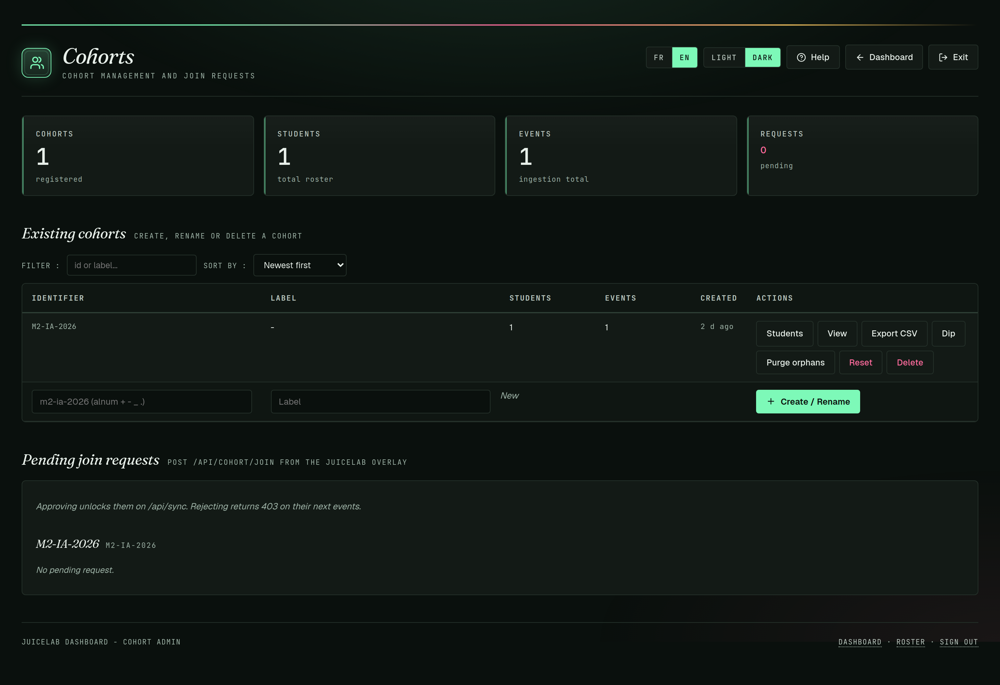

# Coach JuiceLab pour PwnzzAI

🇬🇧 English : [README.md](./README.md)

Un **sidecar** pédagogique qui transforme OWASP [PwnzzAI](https://github.com/OWASP/PwnzzAI)
en un lab guidé et suivi par cohorte — **sans modifier une seule ligne du
produit OWASP**. Il se place devant PwnzzAI comme un reverse proxy transparent
et injecte un panneau coach dans le navigateur de l'élève.

Ce dépôt suit le **modèle JuiceLab** : il ne contient *que* l'overlay
pédagogique. PwnzzAI lui-même n'est **jamais vendoré** — il est cloné à un
commit amont pinné au moment du build (`coach/Dockerfile.pwnzzai`). Aucun code
OWASP, aucun historique OWASP, aucun secret OWASP ne vit ici.

Il apporte à PwnzzAI les quatre recadrages de l'approche JuiceLab :

| # | Recadrage | Comment ça marche ici |
|---|---------|-------------------|
| 1 | **LLM-comme-juge** | Un second appel Ollama lit la transcription de l'attaque et décide si l'objectif du lab a réellement été atteint, avec un score de qualité de 0 à 100. La détection devient automatique *et* qualitative. |
| 2 | **Pas de fork, un sidecar** | Un reverse proxy devant PwnzzAI. L'image OWASP est intacte, donc les mises à jour amont ne cassent jamais le coach. |
| 3 | **Capture de transcription** | `coach.js` patche `fetch`/`XHR` dans le navigateur et enregistre chaque échange élève↔assistant — agnostique au lab, sans parsing par lab. |
| 4 | **Indices adaptatifs** | Le LLM local regarde les tentatives *ratées* de l'élève et le guide, gradué sur 3 niveaux, en FR ou EN. |

Les événements (`session_start`, `hint_revealed`, `challenge_solved`,
`journal_filled`) sont poussés vers le **dashboard prof JuiceLab** via son
contrat public `POST /api/sync`, de sorte qu'une cohorte PwnzzAI apparaît dans
la même matrice prof que Juice Shop.

## Architecture

Le coach est un **reverse proxy transparent** (`pwnzzai-coach`, FastAPI) placé
devant le produit OWASP intact (`pwnzzai-app`). Chaque requête élève transite
par le coach, qui la transmet telle quelle à l'amont et injecte une unique
balise `<script>` `coach.js` dans le HTML renvoyé. Le coach parle à un `ollama`
local pour le LLM-comme-juge et les indices adaptatifs, et remonte les
événements de cohorte au **dashboard prof JuiceLab central** — la même instance
partagée à laquelle les élèves Juice Shop remontent. Le serveur du dashboard
n'est jamais vendoré ici ; PwnzzAI n'en est qu'un client.



Le coach n'a besoin d'aucune connaissance des routes internes de PwnzzAI, donc
les mises à jour amont ne le cassent jamais — bumper `PWNZZAI_COMMIT` et
rebuilder. Détails internes complets :
[docs/ARCHITECTURE.md](./docs/ARCHITECTURE.md).

## Captures d'écran

Côté élève, le panneau Coach JuiceLab injecté par le sidecar dans l'application PwnzzAI (progression, badges, rejoindre une cohorte) :


Les cohortes PwnzzAI remontent vers le même dashboard prof JuiceLab central. Vue prof d'une matrice de cohorte (thème clair ; un bouton clair/sombre se trouve dans la barre du haut) :


La même matrice en thème sombre :



## Lancer

Cette stack est **autonome** — aucun checkout PwnzzAI nécessaire :

```bash
cp .env.example .env        # puis éditer les réglages cohorte/dashboard
docker compose up -d --build
```

- Entrypoint coaché pour les élèves : **http://localhost:8095**
- PwnzzAI brut (debug, contourne le coach) : http://localhost:8090

Tirer les modèles (une fois) :

```bash
docker exec ollama ollama pull llama3.2:1b   # assistant des labs
docker exec ollama ollama pull llama3.2:3b   # juge (1b non fiable)
```

Vérifier la santé :

```bash
curl -s http://localhost:8095/__coach/health
# {"ok":true,"ollama":true,"dashboard_configured":true}
```

> Installation détaillée (un seul script, Windows inclus) :
> [INSTALL_FR.md](./INSTALL_FR.md) · guides élève pas-à-pas :
> [docs/STUDENT-INSTALL-FR.md](./docs/STUDENT-INSTALL-FR.md).

## Câblage cohorte

À régler dans `.env` :

| Variable | Signification |
|---|---|
| `JUICELAB_DASHBOARD_URL` | URL du dashboard **telle que vue depuis le conteneur**. Même machine → `http://host.docker.internal:5000`. Vide → mode local, aucune remontée. |
| `JUICELAB_COHORT_ID` | Cohorte regroupant les élèves dans le dashboard. |
| `JUICELAB_INSTANCE_LABEL` | Nom de cette machine dans la matrice prof (`X-Instance-Label`). |
| `COACH_JUDGE_MODEL` | Modèle juge/indices (ex. `llama3.2:3b`, `mistral:7b`). |
| `PWNZZAI_COMMIT` | Commit OWASP pinné cloné au build. Bumper pour suivre l'amont. |

Le dashboard enregistre automatiquement une paire `(cohorte, jeton)` inconnue
comme `validated` au premier événement — pas d'inscription préalable. Le jeton
élève est un UUID généré dans le navigateur et conservé dans `localStorage`
(`pwnzzai_coach_v1`).

### Dashboard prof (central, partagé)

Le dashboard prof se déploie **une seule fois** et sert JuiceLab ET PwnzzAI.
PwnzzAI n'embarque pas le serveur : il pointe dessus via `JUICELAB_DASHBOARD_URL`.

Si tu veux le déployer depuis cette machine (sans cloner le code élève juice) :

```bash
scripts/deploy-dashboard.sh
```

Cela tire uniquement la partie prof (dashboard + docker) du repo juicelab à la
ref `JUICELAB_DASHBOARD_REF`, puis lance le compose dashboard-only. Renseigne
les secrets dans le `.env` généré (`DASHBOARD_TEACHER_TOKEN`,
`DASHBOARD_PROOF_SECRET`, >= 16 caractères) puis relance.

Anti-pattern : ne déploie pas un second dashboard. Une instance, deux clients.

## Endpoints (API coach)

| Méthode | Chemin | Rôle |
|---|---|---|
| GET | `/__coach/config` | cohorte + labs (concepts du briefing, nombre de questions de quiz) + coût des indices de la cohorte |
| GET | `/__coach/health` | état coach / ollama / dashboard |
| GET | `/__coach/quiz/questions?lab_key=…` | questions de quiz (bonnes réponses retirées) |
| POST | `/__coach/quiz/score` | `{lab_key, answers, lang}` → `{score, by_question}` |
| POST | `/__coach/hint` | `{lab_key, level, lang, transcript}` → indice gradué (N1-N5) + coût |
| POST | `/__coach/judge` | `{lab_key, transcript}` → `{success, score, reason}` |
| POST | `/__coach/event` | relais d'un événement vers le dashboard |
| GET | `/__coach/static/*` | `coach-i18n.js`, `coach-state.js`, `coach-api.js`, `coach.js`, `coach.css` |

## Labs

Le catalogue vit dans [`coach/labs.json`](./coach/labs.json) — une entrée par
page de lab PwnzzAI (chemin, catégorie OWASP LLM, objectif, critères de succès
du juge, contexte des indices). Ajoute ou ajuste les labs là ; rien d'autre n'a
besoin de changer.

## Documentation

Bilingue (FR/EN), plus des guides Word distribuables (même template que la doc
JuiceLab). 🇬🇧 The English index is in [README.md](./README.md).

**Démarrage rapide / scripts**

| Script | Public | Rôle |
|---|---|---|
| [`pwnzzai.sh`](./pwnzzai.sh) / [`pwnzzai.ps1`](./pwnzzai.ps1) | tout le monde | lanceur (`up`/`down`/`restart`/`status`/`logs`/`health`/`models`/`wipe`) |
| [`scripts/install-student.sh`](./scripts/install-student.sh) / [`.ps1`](./scripts/install-student.ps1) | élève | installation en une commande (solo ou cohorte ; n'installe jamais le dashboard) |
| [`scripts/deploy-dashboard.sh`](./scripts/deploy-dashboard.sh) / [`.ps1`](./scripts/deploy-dashboard.ps1) | prof | déploie le dashboard central une seule fois (sparse checkout) |

Référence d'installation complète : [INSTALL_FR.md](./INSTALL_FR.md) (EN : [INSTALL.md](./INSTALL.md)).

**Guides**

| Document | Public |
|---|---|
| [docs/STUDENT-INSTALL-FR.md](./docs/STUDENT-INSTALL-FR.md) | Pas-à-pas installation élève (FR, Windows inclus) — EN : [STUDENT-INSTALL-EN.md](./docs/STUDENT-INSTALL-EN.md) |
| [INSTALL_FR.md](./INSTALL_FR.md) | Référence d'installation (FR) — EN : [INSTALL.md](./INSTALL.md) |
| [docs/GUIDE-FR.md](./docs/GUIDE-FR.md) | Guide complet (FR) — prof + élève — EN : [GUIDE-EN.md](./docs/GUIDE-EN.md) |
| [docs/ARCHITECTURE.md](./docs/ARCHITECTURE.md) | Internes, protocole, diagrammes Mermaid (FR) — EN : [ARCHITECTURE-EN.md](./docs/ARCHITECTURE-EN.md) |
| docs/GUIDE-INSTALL-ELEVE.docx | Guide Word imprimable — **élève** (aucun contenu prof/dashboard) |
| docs/GUIDE-INSTALL-PROF.docx | Guide Word imprimable — **prof** (déploiement dashboard, events, juge) |
| docs/GUIDE-COACH-PWNZZAI.docx | Guide Word combiné (historique ; les deux guides scindés ci-dessus sont les docs d'install principales) |

Régénérer les `.docx` d'install scindés (nécessite `python3.11` + `python-docx` ;
le `python3` par défaut ici est 3.13 sans `python-docx`) :

```bash
cd docs && npm install @mermaid-js/mermaid-cli   # une fois, pour les diagrammes (mmdc)
python3.11 build_install_guides.py               # -> GUIDE-INSTALL-ELEVE/PROF.docx
```

Régénérer le `.docx` combiné historique :

```bash
cd docs && python3.11 build_coach_guide.py       # -> GUIDE-COACH-PWNZZAI.docx
```

## Pourquoi ça survit aux changements amont

Le proxy n'a besoin d'aucune connaissance des routes internes de PwnzzAI : il
transmet tout et n'injecte qu'une balise `<script>`. La capture de transcription
est générique (tout POST `fetch`/`XHR` portant un champ texte). Quand OWASP
publie une nouvelle version, bumper `PWNZZAI_COMMIT` et rebuilder ; seul
`coach/labs.json` peut nécessiter une mise à jour de chemin pour la *détection*
des labs.

## Licence

L'overlay coach est publié sous licence MIT. OWASP PwnzzAI est la propriété de
ses auteurs et est récupéré depuis l'amont au moment du build sous sa propre
licence.
