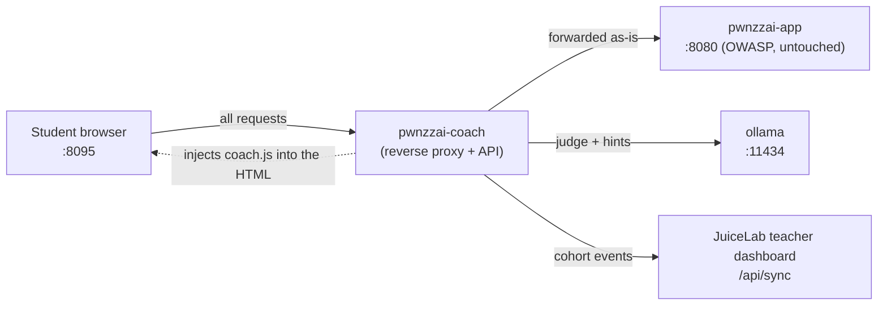
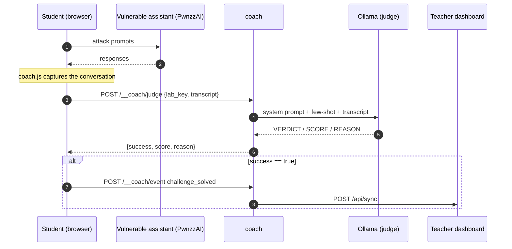

# JuiceLab Coach for PwnzzAI — Architecture

> 🇫🇷 Français : [ARCHITECTURE.md](./ARCHITECTURE.md)
>
> User guides: [GUIDE-EN.md](./GUIDE-EN.md) · [GUIDE-FR.md](./GUIDE-FR.md)

This document describes the internal workings of the coach sidecar: data flows,
event protocol, and design rationale. Audience: coach maintainer, or a teacher
who wants to understand/audit what flows through it.

## 1. Principle: a sidecar, not a fork

The coach is a **transparent reverse proxy** placed in front of PwnzzAI. It
forwards every request without understanding it and only adds a `<script>` tag
to the HTML responses. The OWASP image is never modified, so an OWASP upstream
update does not break the coach.



## 2. Components

| File | Role |
|---|---|
| `app.py` | FastAPI proxy + `/__coach/*` endpoints |
| `llm_judge.py` | LLM-as-judge + adaptive hint generation (Ollama) |
| `dashboard_client.py` | sends events to the dashboard (`POST /api/sync`) |
| `static/coach.js` | injected sidebar + conversation capture (browser) |
| `static/coach.css` | sidebar styles (prefixed `coach-*`) |
| `labs.json` | lab catalogue (detection, objectives, judge criteria) |

## 3. Coach endpoints

| Method | Path | Role |
|---|---|---|
| GET | `/__coach/config` | cohort + lab catalogue for the sidebar |
| GET | `/__coach/health` | coach / ollama / dashboard status |
| POST | `/__coach/hint` | `{lab_key, level, lang, transcript}` → hint |
| POST | `/__coach/judge` | `{lab_key, transcript}` → `{success, score, reason}` |
| POST | `/__coach/event` | relays an event to the dashboard |
| GET | `/__coach/static/*` | `coach.js`, `coach.css` |

Every other path is forwarded to PwnzzAI unmodified.

## 4. Conversation capture (browser side)

`coach.js` replaces `fetch` and `XMLHttpRequest` with versions that observe the
page's POSTs. For each POST not destined for the coach:

- the **request** is inspected for a text field among `message`, `query`,
  `prompt`, `input`, `question`, `text`, `user_message`, `msg`, `content`,
  `doc`, `document` → recorded as a `user` turn;
- the **response** is inspected for a field among `response`, `answer`,
  `reply`, `result`, `output`, `message`, `content`, `text`, `completion`,
  `data` → recorded as an `assistant` turn.

This is **generic**: no per-lab logic. A new PwnzzAI lab that uses one of these
fields is captured automatically.

## 5. Lab detection

`coach.js` compares `window.location.pathname` against the `match` prefixes in
`labs.json`, longest wins (`/data-poisoning/catering-rag` before
`/data-poisoning`). The detected lab provides the objective, OWASP category,
success criteria (for the judge) and context (for the hints).

## 6. The judge (LLM-as-judge)



The judge grades the **assistant's responses**, not the student's requests: a
polite attack that the assistant refuses is a failure; a trivial attack the
assistant gives in to is a success. A few-shot in the system prompt stabilizes
small models. The parser degrades gracefully if the output is not in the
expected format.

> The 1b model is not reliable enough as a judge (inconsistent verdicts).
> Recommended minimum: `llama3.2:3b` via `COACH_JUDGE_MODEL`. See the guides.

## 7. Dashboard protocol (the cohort)

The coach speaks the **public contract** of the JuiceLab dashboard, identical to
the one Juice Shop uses:

```
POST {JUICELAB_DASHBOARD_URL}/api/sync
Header: X-Instance-Label: {JUICELAB_INSTANCE_LABEL}
Body:
{
  "student_token":    "<uuid genere dans le navigateur>",
  "cohort_id":        "{JUICELAB_COHORT_ID}",
  "event_type":       "session_start | hint_revealed | challenge_solved | journal_filled",
  "challenge_key":    "pwnzzai-...",
  "data":             { ... },
  "client_timestamp": "<ISO 8601>"
}
```

`cohort_id` and `instance_label` come from the server environment (not the
browser): a student cannot impersonate another cohort. The dashboard records an
unknown `(cohort, token)` pair as `validated` on the first event — no
pre-enrolment. If the dashboard is unreachable, `coach.js` queues the event
locally (`pwnzzai_coach_queue_v1`) and resends it later.

## 8. Resilience to OWASP changes

| Upstream OWASP change | Impact on the coach |
|---|---|
| Restyle of a page, new CSS | none (injection before `</head>`) |
| New chat route using a known text field | captured automatically |
| Renaming of a lab path | update the `match` in `labs.json` |
| New lab | add an entry in `labs.json` |
| Complete engine rewrite | proxy intact; review `labs.json` |

The only file likely to require maintenance is `labs.json`, and only for
**detection** and **pedagogical wording** — never the proxy itself.
