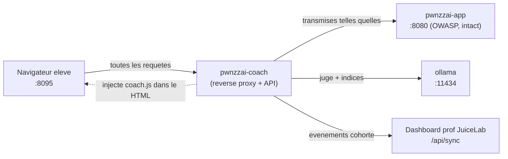
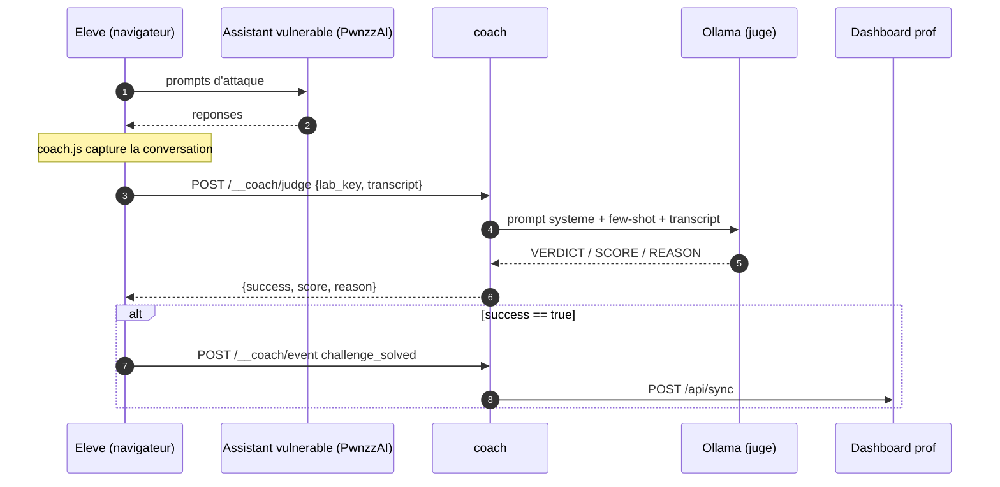

# Coach JuiceLab pour PwnzzAI — Architecture

> Guides utilisateur : [GUIDE-FR.md](./GUIDE-FR.md) · [GUIDE-EN.md](./GUIDE-EN.md)

Ce document décrit le fonctionnement interne du sidecar coach : flux de
données, protocole d'événements, et raisons de conception. Public : mainteneur
du coach, ou enseignant qui veut comprendre/auditer ce qui circule.

## 1. Principe : un sidecar, pas un fork

Le coach est un **reverse proxy transparent** placé devant PwnzzAI. Il
transmet chaque requête sans la comprendre et n'ajoute qu'une balise
`<script>` dans les réponses HTML. L'image OWASP n'est jamais modifiée, donc
une mise à jour amont d'OWASP ne casse pas le coach.



## 2. Composants

| Fichier | Rôle |
|---|---|
| `app.py` | proxy FastAPI + endpoints `/__coach/*` |
| `llm_judge.py` | LLM-as-judge + génération d'indices adaptatifs (Ollama) |
| `dashboard_client.py` | envoi des événements au dashboard (`POST /api/sync`) |
| `static/coach.js` | sidebar injectée + capture de conversation (navigateur) |
| `static/coach.css` | styles de la sidebar (préfixés `coach-*`) |
| `labs.json` | catalogue des labs (détection, objectifs, critères du juge) |

## 3. Endpoints du coach

| Méthode | Chemin | Rôle |
|---|---|---|
| GET | `/__coach/config` | cohorte + catalogue des labs pour la sidebar |
| GET | `/__coach/health` | état coach / ollama / dashboard |
| POST | `/__coach/hint` | `{lab_key, level, lang, transcript}` → indice |
| POST | `/__coach/judge` | `{lab_key, transcript}` → `{success, score, reason}` |
| POST | `/__coach/event` | relais d'un événement vers le dashboard |
| GET | `/__coach/static/*` | `coach.js`, `coach.css` |

Tout le reste des chemins est transmis à PwnzzAI sans modification.

## 4. Capture de conversation (côté navigateur)

`coach.js` remplace `fetch` et `XMLHttpRequest` par des versions qui observent
les POST de la page. Pour chaque POST non destiné au coach :

- la **requête** est inspectée pour un champ texte parmi `message`, `query`,
  `prompt`, `input`, `question`, `text`, `user_message`, `msg`, `content`,
  `doc`, `document` → enregistré comme tour `user` ;
- la **réponse** est inspectée pour un champ parmi `response`, `answer`,
  `reply`, `result`, `output`, `message`, `content`, `text`, `completion`,
  `data` → enregistré comme tour `assistant`.

C'est **générique** : aucune logique par lab. Un nouveau lab PwnzzAI qui
utilise un de ces champs est capturé automatiquement.

## 5. Détection du lab

`coach.js` compare `window.location.pathname` aux préfixes `match` de
`labs.json`, le plus long l'emportant (`/data-poisoning/catering-rag` avant
`/data-poisoning`). Le lab détecté fournit objectif, catégorie OWASP, critères
de succès (pour le juge) et contexte (pour les indices).

## 6. Le juge (LLM-as-judge)



Le juge note les **réponses de l'assistant**, pas les requêtes de l'élève :
une attaque polie que l'assistant refuse est un échec ; une attaque triviale à
laquelle l'assistant cède est une réussite. Un few-shot dans le prompt système
stabilise les petits modèles. Le parseur dégrade proprement si la sortie
n'est pas au format attendu.

> Le modèle 1b n'est pas assez fiable comme juge (verdicts incohérents).
> Minimum conseillé : `llama3.2:3b` via `COACH_JUDGE_MODEL`. Voir les guides.

## 7. Protocole dashboard (la cohorte)

Le coach parle le **contrat public** du dashboard JuiceLab, identique à celui
de Juice Shop :

```
POST {JUICELAB_DASHBOARD_URL}/api/sync
Header: X-Instance-Label: {JUICELAB_INSTANCE_LABEL}
Body:
{
  "student_token":    "<uuid genere dans le navigateur>",
  "cohort_id":        "{JUICELAB_COHORT_ID}",
  "event_type":       "session_start | hint_revealed | challenge_solved | journal_filled",
  "challenge_key":    "pwnzzai-...",
  "data":             { ... },
  "client_timestamp": "<ISO 8601>"
}
```

`cohort_id` et `instance_label` viennent de l'environnement serveur (et non du
navigateur) : un élève ne peut pas usurper une autre cohorte. Le dashboard
enregistre une paire `(cohorte, jeton)` inconnue comme `validated` au premier
événement — pas d'inscription préalable. Si le dashboard est injoignable,
`coach.js` met l'événement dans une file locale (`pwnzzai_coach_queue_v1`) et
le renvoie plus tard.

## 8. Résilience aux évolutions d'OWASP

| Changement amont OWASP | Impact sur le coach |
|---|---|
| Restyle d'une page, nouveau CSS | aucun (injection avant `</head>`) |
| Nouvelle route de chat utilisant un champ texte connu | capturé automatiquement |
| Renommage d'un chemin de lab | mettre à jour le `match` dans `labs.json` |
| Nouveau lab | ajouter une entrée dans `labs.json` |
| Refonte complète du moteur | proxy intact ; revoir `labs.json` |

Le seul fichier susceptible de demander une maintenance est `labs.json`, et
uniquement pour la **détection** et la **formulation pédagogique** — jamais le
proxy lui-même.
