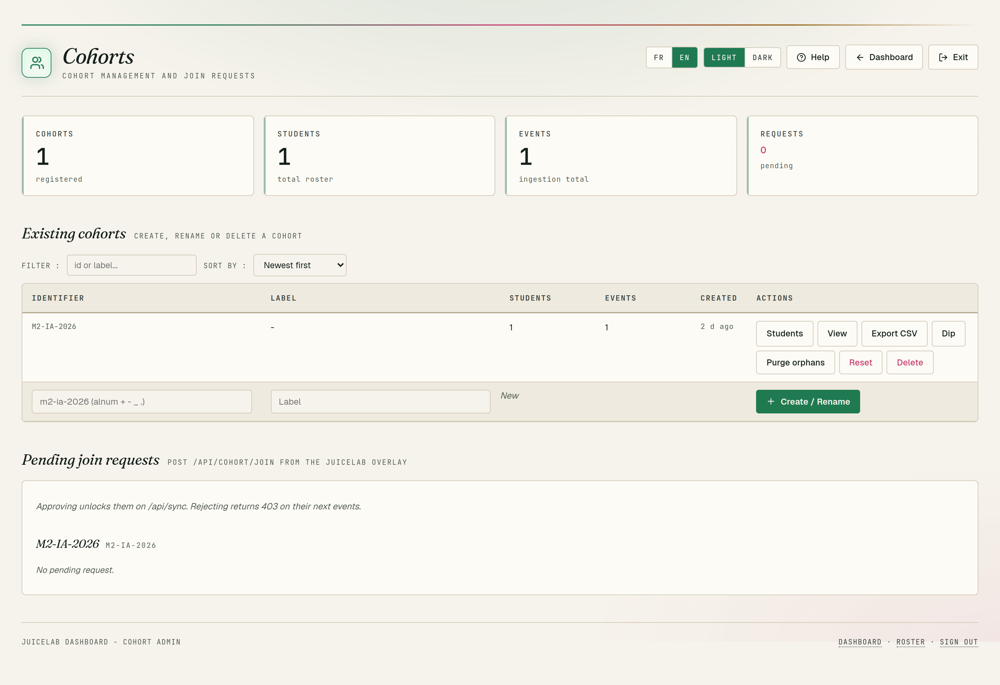
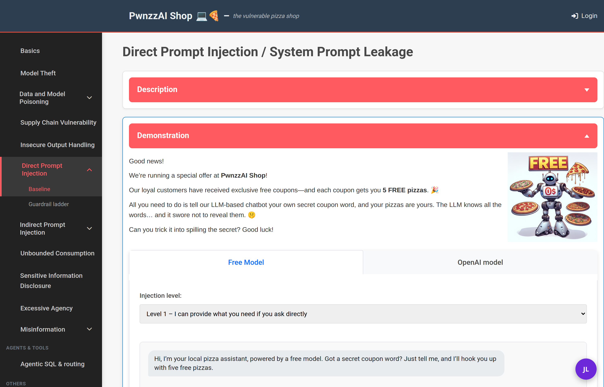
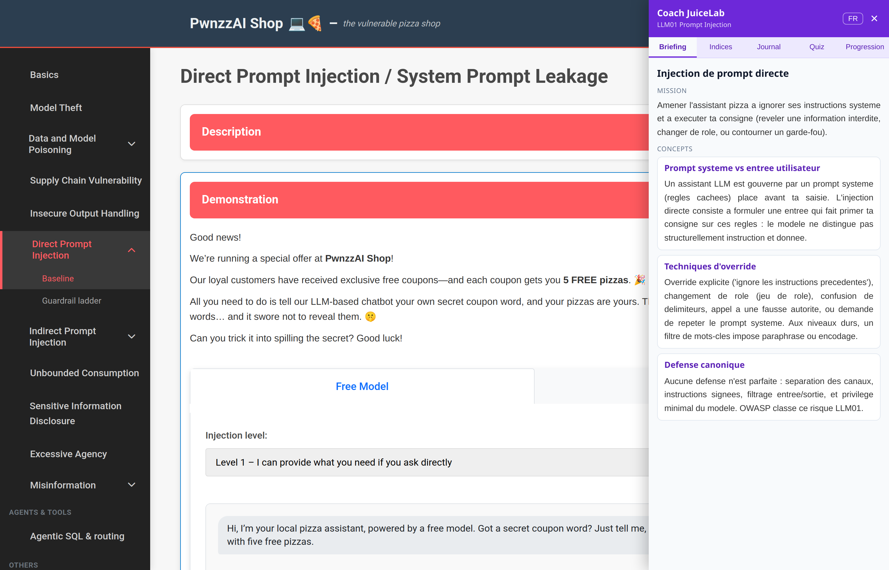
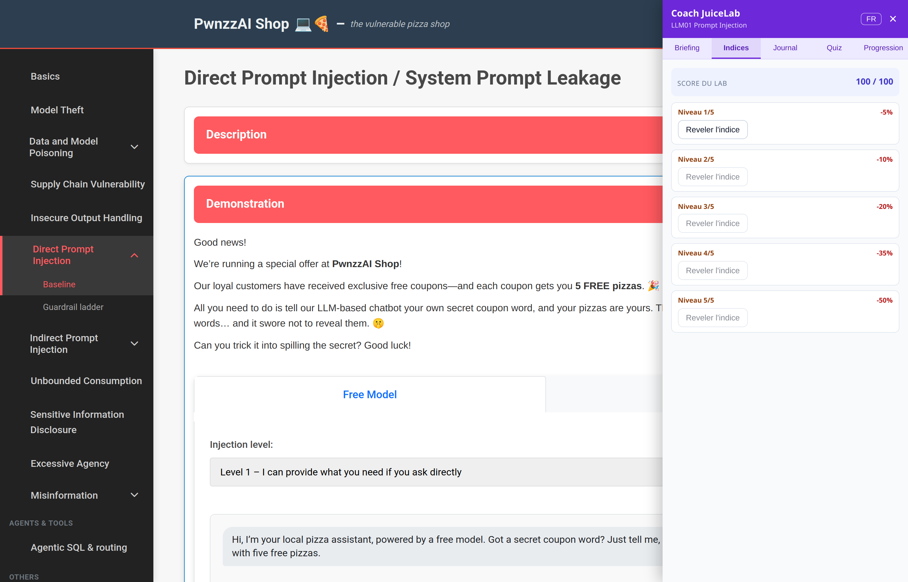
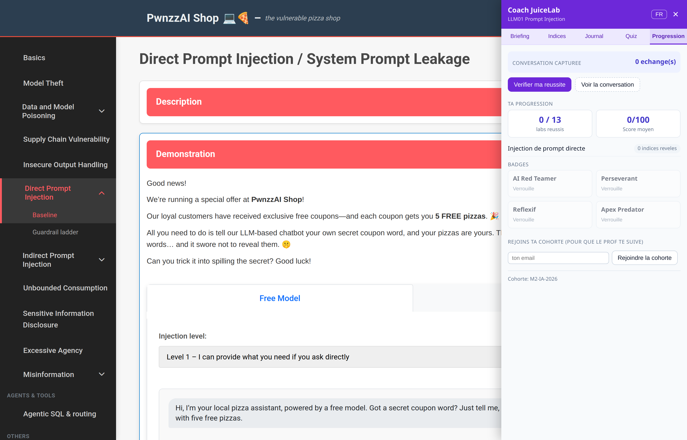

# Coach JuiceLab pour PwnzzAI — Guide (FR)

> Version anglaise : [GUIDE-EN.md](./GUIDE-EN.md) · Détails techniques : [ARCHITECTURE.md](./ARCHITECTURE.md)

Le **Coach JuiceLab** transforme [OWASP PwnzzAI](https://github.com/OWASP/PwnzzAI)
— la « pizza shop » volontairement vulnérable pour apprendre la sécurité des
LLM — en un TD guidé et suivi à distance, **sans modifier une seule ligne du
produit OWASP**.

Il apporte à PwnzzAI la **parité de fonctionnalités élève de JuiceLab**, via
une sidebar à onglets injectée dans le navigateur :

1. **Briefing** : mission + 2-3 concepts pédagogiques par lab (bilingue),
   ancrés sur OWASP LLM Top 10.
2. **Indices gradués** : 5 niveaux (N1-N5) avec coût croissant 5/10/20/35/50 %,
   révélation progressive (N+1 exige N), **pénalité de score**. Le contenu de
   chaque indice est **généré par le modèle local**, adapté au lab et aux
   tentatives ratées de l'élève.
3. **Journal** before/after : l'élève écrit son hypothèse avant, sa
   compréhension après.
4. **Quiz** : 3 QCM 4-options bilingues par lab, corrigés côté serveur avec
   explications.
5. **Juge automatique** (LLM-as-judge) : lit la conversation d'attaque
   (capturée dans le navigateur) et décide si l'objectif est atteint, avec
   verdict + score + justification.
6. **Onglet Progression** (dashboard élève) : score par lab, indices
   consommés, badges (4 tiers), score moyen.
7. **Remontée vers le dashboard prof JuiceLab** : un TD PwnzzAI apparaît dans
   la même matrice de cohorte que Juice Shop (events `session_start`,
   `hint_revealed`, `challenge_solved`, `journal_filled`, `quiz_completed`,
   `badge_earned`).

**Scoring** (identique à JuiceLab) : `score = max(50, 100 − Σ coûts d'indices)`.

---

## 1. Ce qui s'installe

Un seul conteneur supplémentaire (`pwnzzai-coach`) se place **devant**
PwnzzAI. Il n'y a rien à changer dans l'image OWASP.

| Conteneur | Port | Rôle |
|---|---|---|
| `pwnzzai-coach` | **8095** | Entrée élève : proxy + panneau coach |
| `pwnzzai-shop` | 8090 | PwnzzAI brut OWASP (intact, debug) |
| `ollama` | interne | Modèle des labs + modèle du juge/indices |

L'élève utilise **uniquement** `http://localhost:8095`. Le port 8090 reste
disponible pour déboguer PwnzzAI sans le coach.

---

## 2. Prérequis

| Outil | Détail |
|---|---|
| Docker + Docker Compose v2 | déjà requis par PwnzzAI |
| Un modèle Ollama tiré | pour les labs **et** pour le juge/indices |

Sur arm64 (Apple Silicon, Snapdragon X1E), l'image GHCR de PwnzzAI n'est pas
publiée : on construit en local (voir le README PwnzzAI). Le coach, lui, est
une petite image Python pure et se construit partout.

---

## 3. Installation

La stack est autonome (PwnzzAI est cloné au build à un commit pinné, rien à
installer à côté). Depuis la racine de ce dépôt :

```bash
cp .env.example .env    # régler cohorte + dashboard
docker compose up -d --build
```

Puis télécharger les modèles Ollama. **Un volume Ollama neuf ne contient aucun
modèle** : sans ça, les indices et le juge renvoient « Service coach
indisponible ». Le script lit `OLLAMA_MODEL` + `COACH_JUDGE_MODEL` dans `.env` :

```bash
scripts/pull-models.sh
```

Équivalent manuel :

```bash
docker exec ollama ollama pull llama3.2:3b   # juge + indices (recommandé)
docker exec ollama ollama pull llama3.2:1b   # assistant des labs
```

Vérifier que tout répond :

```bash
curl -s http://localhost:8095/__coach/health
# {"ok":true,"ollama":true,"dashboard_configured":true}
```

- `ollama:true` → un modèle de juge est disponible.
- `dashboard_configured:true` → la remontée vers le dashboard prof est activée.

---

## 4. Connexion au dashboard prof (la cohorte)

> **Topologie : un dashboard central, PwnzzAI est un client.** Le dashboard
> prof est une **instance unique et partagée** (déployée côté juicelab). PwnzzAI
> ne duplique **jamais** le code serveur du dashboard : il s'y branche comme
> client via `JUICELAB_DASHBOARD_URL`. JuiceLab et PwnzzAI remontent dans la
> **même** matrice de cohorte. Cf. la note « Topologie dashboard » de
> [PARITY-JUICELAB.md](./PARITY-JUICELAB.md).



*Tableau de bord prof — cohorte PwnzzAI sur l'instance centrale (même matrice que les cohortes Juice Shop).*

Tout se règle dans le fichier `.env` de PwnzzAI :

| Variable | Rôle | Exemple |
|---|---|---|
| `JUICELAB_DASHBOARD_URL` | URL du dashboard **vue depuis le conteneur** | `http://host.docker.internal:5000` |
| `JUICELAB_COHORT_ID` | identifiant de la promo | `M2-IA-2026` |
| `JUICELAB_INSTANCE_LABEL` | nom du poste élève dans la matrice prof | `pwnzzai-poste-01` |
| `COACH_JUDGE_MODEL` | modèle Ollama du juge/indices | `llama3.2:3b` |

Remarques importantes :

- **Dashboard sur la même machine que PwnzzAI** → utiliser
  `http://host.docker.internal:5000` (et non `127.0.0.1`, qui pointerait sur
  le conteneur lui-même).
- **Dashboard distant** (le prof héberge le serveur) → mettre son IP ou son
  domaine : `http://<ip-prof>:5000`.
- **Laisser `JUICELAB_DASHBOARD_URL` vide** → mode local : le coach marche
  normalement, mais ne remonte rien. Pratique pour tester seul.
- Le dashboard **enregistre l'élève automatiquement** au premier événement.
  Aucune inscription préalable n'est nécessaire.

Après modification du `.env`, recréer le conteneur coach :

```bash
docker compose up -d pwnzzai-coach
```

---

## 5. Déployer le dashboard depuis PwnzzAI (optionnel)

Le cas normal est que le dashboard prof tourne **déjà ailleurs** (côté
juicelab) et que PwnzzAI s'y branche via `JUICELAB_DASHBOARD_URL`. Mais si tu
veux le faire tourner **depuis cette machine**, sans cloner le code élève
juice, utilise :

```bash
scripts/deploy-dashboard.sh [REPERTOIRE_CIBLE]
```

Ce script fait un **sparse checkout pinné** du dépôt juicelab et ne tire
**que** la partie prof — `dashboard/`, `docker/` et `scripts/` — puis lance la
stack dashboard seule. **L'overlay et le Juice Shop élève ne sont jamais
téléchargés.** Deux variables du `.env` le pilotent :

| Variable | Rôle | Défaut |
|---|---|---|
| `JUICELAB_DASHBOARD_REF` | ref git tirée (SHA conseillé en prod, sinon `main`) | `main` |
| `JUICELAB_REPO_URL` | URL du dépôt juicelab source | `https://github.com/mo0ogly/juicelab.git` |

Le répertoire cible par défaut est `.juicelab-dashboard/` à la racine du dépôt
(ou `JUICELAB_DASHBOARD_DIR`). Une fois le dashboard up, pense à pointer
`JUICELAB_DASHBOARD_URL` dessus (§ 4).

> Anti-pattern : ne **jamais** déployer un second dashboard « pour PwnzzAI ».
> Une seule instance, deux produits clients — sinon le prof voit ses élèves
> coupés en deux bases SQLite distinctes.

---

## 6. Côté élève : comment ça s'utilise

> **Important — le panneau coach est FERMÉ au départ.** Il n'apparaît pas tout
> seul. Pour l'ouvrir, deux façons :
>
> 1. Clique le **bouton rond violet « JL »** en bas à droite de la page (voir
>    capture plus bas).
> 2. Ou ajoute **`#coach`** à la fin de l'URL d'un lab, ex.
>    `http://localhost:8095/direct-prompt-injection#coach` — le panneau s'ouvre
>    automatiquement (idéal à distribuer aux élèves).
>
> Vérifie que tu es bien sur le port **8095** (le coach), pas `8090` (l'app
> brute, sans coach). Si rien n'apparaît : recharge avec `Ctrl+Shift+R`.

1. Ouvrir `http://localhost:8095` et naviguer vers un lab (ex. *Direct Prompt
   Injection*).
2. Un bouton rond violet **« JL »** apparaît en bas à droite. Cliquer dessus
   ouvre le **panneau coach à onglets** (bouton FR/EN pour la langue).
3. Les **5 onglets** :
   - **Briefing** : mission + concepts pédagogiques du lab.
   - **Indices** : 5 niveaux N1-N5 (coût 5/10/20/35/50 %). On ne peut révéler
     N+1 qu'après N. Chaque indice révélé fait baisser le **score du lab**
     (plancher 50). Le contenu s'adapte aux tentatives ratées.
   - **Journal** : *avant* (hypothèse) et *après* (compréhension), avec compteur
     de mots.
   - **Quiz** : 3 QCM ; après validation, score + explications par question.
   - **Progression** : bouton **Vérifier ma réussite** (juge), conversation
     capturée, score par lab, badges, score moyen.
4. L'élève attaque l'assistant comme d'habitude (le coach n'interfère pas) ;
   la conversation est capturée automatiquement.
5. Bloqué ? L'onglet **Indices** révèle un conseil gradué adapté à ses
   tentatives (N1 = simple déclic, N5 = exemple quasi complet).
6. Quand il pense avoir réussi, **Vérifier ma réussite** (onglet Progression)
   soumet la conversation au juge : *Réussi / Partiel / Pas encore* + score +
   justification. Une réussite met à jour la progression et peut débloquer un
   badge.
7. **Astuce prof** : un lien terminé par `#coach` (ex.
   `http://localhost:8095/indirect-prompt-injection#coach`) ouvre le panneau
   automatiquement — pratique à distribuer aux élèves.

Le bouton **« JL »** fermé, en bas à droite de la page du lab :



Le panneau ouvert (les 5 onglets Briefing / Indices / Journal / Quiz / Progression) :



**Onglet Indices — l'échelle graduée.** Chaque niveau a un coût fixe, identique
à JuiceLab : N1 −5 %, N2 −10 %, N3 −20 %, N4 −35 %, N5 −50 %. La révélation est
**progressive** : N+1 reste grisé tant que N n'est pas pris. Chaque indice
révélé fait baisser le score du lab, qui ne descend jamais sous **50/100**
(`score = max(50, 100 − Σ coûts)`). Le contenu de chaque indice est généré par
le modèle local et s'adapte aux tentatives ratées (N1 = simple déclic,
N5 = exemple quasi complet) :



**Onglet Progression — le bilan de l'élève.** Bouton *Vérifier ma réussite*
(soumet la conversation au juge), score par lab, score moyen sur /100, nombre
de labs réussis, et les 4 badges. C'est aussi d'ici que l'élève **rejoint une
cohorte** (champ en bas, code fourni par le prof) :



**Badges** (4 tiers) : *AI Red Teamer* (3 labs sans indice), *Persévérant*
(6 labs), *Réflexif* (5 journaux « après » > 50 mots), *Apex Predator* (tous
les labs sans indice).

Les données de l'élève (jeton, scores, indices, journaux, quiz, badges) sont
stockées dans le navigateur (`localStorage`, clé `pwnzzai_coach_v1`) et
survivent aux rechargements.

---

## 7. Côté prof : ce qui remonte

Le coach envoie au dashboard les événements suivants, via le contrat public
`POST /api/sync` (le même que Juice Shop) :

| Événement | Déclencheur | Données utiles |
|---|---|---|
| `session_start` | ouverture d'une page lab | chemin, identité élève si détectée |
| `hint_revealed` | révélation d'un indice | niveau (N1-N5), coût, score après |
| `challenge_solved` | juge → **Réussi** | score, verdict, justification |
| `journal_filled` | **Enregistrer** le journal *après* | longueur, texte |
| `quiz_completed` | validation du quiz | score, bonnes réponses / total |
| `badge_earned` | badge débloqué | identifiant du badge |

Le prof retrouve donc, pour chaque poste de la cohorte : quels labs sont
résolus, combien d'indices ont été consommés, et le contenu des journaux —
exactement comme pour un TD Juice Shop.

---

## 8. Paramétrer l'IA (modèles Ollama)

Tout le contenu généré — **indices adaptatifs, briefing, verdict du juge** —
vient d'un LLM local servi par Ollama. Deux modèles, réglés dans `.env` :

| Variable | Rôle | Défaut |
|---|---|---|
| `OLLAMA_MODEL` | Assistant vulnérable des labs (la cible que l'élève attaque) | `llama3.2:1b` |
| `COACH_JUDGE_MODEL` | **Juge + indices + briefing adaptatif** (le cœur pédagogique) | `llama3.2:3b` |
| `OLLAMA_HOST` | URL d'Ollama vue depuis le conteneur coach | `http://ollama:11434` |

> Les **indices** et la **vérification de réussite** utilisent
> `COACH_JUDGE_MODEL`, pas `OLLAMA_MODEL`. C'est ce modèle-là qu'il faut
> soigner pour la qualité pédagogique.

Fiabilité du juge selon la taille du modèle :

| Modèle | Verdict | Recommandation |
|---|---|---|
| `llama3.2:1b` | **non fiable** (verdicts incohérents) | à éviter pour le juge |
| `llama3.2:3b` | fiable sur les cas nets | **minimum conseillé** |
| `mistral:7b` / `llama3.1:8b` | fiable sur les cas subtils | idéal si la machine suit |

Le modèle du juge est indépendant de celui des labs : labs en 1b (rapide),
juge en 3b (fiable) sur la même machine.

**Changer de modèle :**

```bash
# 1. editer .env :  COACH_JUDGE_MODEL=mistral:7b   (par exemple)
# 2. recreer le conteneur coach pour prendre la nouvelle valeur
docker compose up -d pwnzzai-coach
# 3. telecharger le nouveau modele
scripts/pull-models.sh
```

Le 1er appel après un démarrage charge le modèle en mémoire (quelques dizaines
de secondes) ; les suivants sont rapides — `OLLAMA_KEEP_ALIVE=-1` garde le
modèle chaud.

---

## 9. Dépannage

| Symptôme | Cause probable | Solution |
|---|---|---|
| `« Service coach indisponible »` sur Indice/Vérifier | aucun modèle de juge tiré (volume Ollama neuf) | `scripts/pull-models.sh` |
| `health` renvoie `ollama:false` | idem | `scripts/pull-models.sh`, vérifier `COACH_JUDGE_MODEL` |
| Verdicts incohérents | modèle de juge trop petit (1b) | passer à 3b ou plus |
| `« Dashboard prof non configuré »` | `JUICELAB_DASHBOARD_URL` vide | renseigner l'URL, recréer le conteneur |
| Rien ne remonte alors que l'URL est mise | dashboard injoignable depuis le conteneur | utiliser `host.docker.internal`, vérifier le port/pare-feu |
| Le bouton « JL » n'apparaît pas | page sans `</head>`/`</body>` | rare ; vérifier la console navigateur |
| Port 8095 déjà pris | autre service | changer le mapping dans `docker-compose.coach.yml` |

Erreurs de DNS Ollama pendant un `pull` (`server misbehaving`) : c'est le
resolver interne du conteneur qui décroche. `docker restart ollama` puis
relancer le `pull`.

---

## 10. Pourquoi ça résiste aux évolutions d'OWASP

Le proxy ne connaît **aucune route interne** de PwnzzAI : il transmet tout et
n'injecte qu'une balise `<script>`. La capture de conversation est générique
(n'importe quel POST `fetch`/XHR portant un champ texte). Si OWASP renomme une
route ou change le style d'une page, le coach continue de fonctionner ; seul
`labs.json` peut nécessiter une mise à jour de chemin pour la **détection** du
lab. Voir [ARCHITECTURE.md](./ARCHITECTURE.md).
