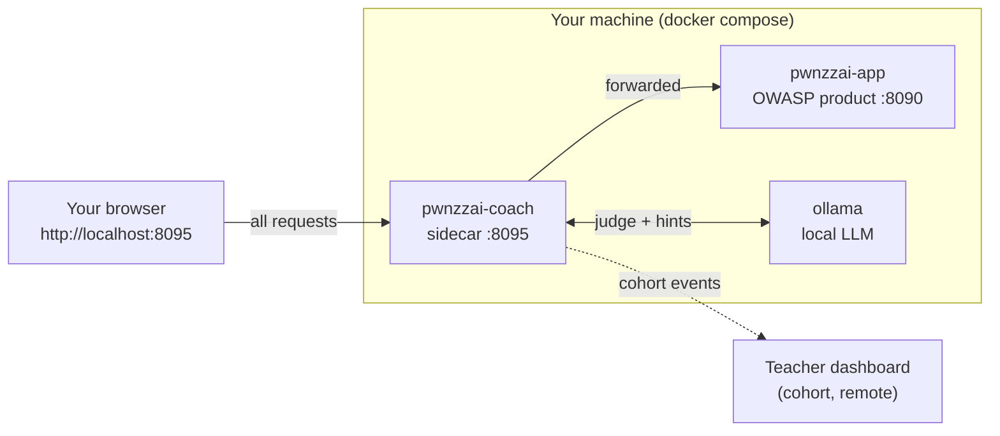

# Student install guide — PwnzzAI (JuiceLab Coach)

> Goal: get OWASP PwnzzAI + the JuiceLab Coach working on your laptop in **10 to 15 minutes**, on `http://localhost:8095`.

> Localized version: [STUDENT-INSTALL-FR.md](./STUDENT-INSTALL-FR.md) (français).

---

## 0. Pick your mode BEFORE installing

There are **two modes**. The only difference is whether your progress is **reported** to the teacher dashboard. Read this table first.

| Your situation | Mode | What you run | The teacher dashboard ? |
|---|---|---|---|
| **Lab with a teacher** (normal case) | **Cohort** | The full PwnzzAI stack ; your events are pushed to the teacher's dashboard | **NO, you do NOT install it.** The teacher hosts it. |
| You work **alone, no teacher** (revision, self-study) | **Solo** | The full PwnzzAI stack ; no reporting | **NO.** PwnzzAI has no student dashboard: the coach works locally, with no reporting. |

> **WARNING — common mistake.** In **no mode** do you install a dashboard on your laptop. PwnzzAI ships **no student dashboard at all**. During a lab (cohort mode), the teacher hosts the single central dashboard; you simply **point** at it with `-d <teacher-ip>` (section 3.2) and ask them for the **IP**. In solo mode there is simply no reporting — the coach (hints, judge, quiz, badges) still works locally.

> In both modes, the stack running on your machine is **identical** (3 containers). Only the `JUICELAB_DASHBOARD_URL` key changes: set in cohort mode, empty in solo mode.

---

## 1. What you will install

PwnzzAI runs as **a single `docker compose` stack** at the repo root. Three containers, always all three, regardless of mode:

| Container | Host port | What it does | Mode |
|---|---|---|---|
| `pwnzzai-coach` | **8095** → 8090 | **Student entrypoint**: proxy + coach panel (hints, judge, quiz, badges) | Cohort **and** Solo |
| `pwnzzai-shop` | 8090 → 8080 | Raw OWASP PwnzzAI (untouched, for debug) | Cohort **and** Solo |
| `ollama` | internal | Local LLM: lab model + judge/hint model (volume `ollama_data`) | Cohort **and** Solo |



You use **only** `http://localhost:8095` (the coach). Port `8090` stays available to debug PwnzzAI without the coach.

The coach **does not modify** the OWASP product: it sits in front of it as a transparent proxy and injects a `<script>` into the page.

The first `docker compose up --build` builds the PwnzzAI image (cloned at a pinned commit): count **5 to 8 minutes**. After that, every start is roughly **10 seconds**. After the first `up`, you must **pull the Ollama models** (~2-3 GB download) — the installer does it automatically.

In cohort mode, no sensitive data leaves your laptop beyond the **progression events** (`session_start`, `hint_revealed`, `challenge_solved`, `journal_filled`, `quiz_completed`, `badge_earned`) sent to the teacher dashboard you point to. In solo mode, nothing leaves.

---

## 2. Prerequisites

| Tool | Minimum version | Where to get it |
|---|---|---|
| **Docker Desktop** (Windows / macOS) or **Docker Engine** (Linux) | 24+ | <https://www.docker.com/products/docker-desktop> |
| **Docker Compose v2** | bundled with Docker Desktop ; on Linux : `sudo apt install docker-compose-v2` (distro) or `docker-compose-plugin` (official Docker repo) — see Appendix A | — |
| **Git** | any recent version | <https://git-scm.com/downloads> |
| **RAM** | 8 GB free recommended (Ollama loads the judge model in memory) | — |
| **Disk** | 6 GB free (PwnzzAI image + Ollama models) | — |

Quick sanity check :

```bash
docker --version            # Docker version 24.x or newer
docker compose version      # Docker Compose v2.x or newer
git --version
```

If `docker compose version` errors out, your Docker is too old. On Linux : `sudo apt install docker-compose-v2` (Ubuntu/Debian standard) or `sudo apt install docker-compose-plugin` (official Docker repo). On Windows / macOS : update Docker Desktop.

> **RAM/Ollama note.** The coach uses a local LLM (Ollama) for hints and the judge. The default judge model (`llama3.2:3b`) fits in ~3-4 GB of RAM; leave some headroom. On a tight machine, keep the judge at `llama3.2:3b` (do not drop to `1b`: unreliable verdicts).

---

## 3. One-shot install (recommended)

Same flow on Linux, macOS, and Windows.

### 3.1 Clone the repo

```bash
git clone https://github.com/mo0ogly/PwnzzAI.git
cd PwnzzAI
```

### 3.2 Run the installer

Replace `M2-IA-2026` with the cohort identifier your teacher gave you, and `192.168.1.10` with the **teacher dashboard IP** they gave you. If you do not pass `-c`, the script asks for the cohort interactively.

#### Cohort mode — lab with a teacher (recommended)

Full stack, events pushed to the teacher dashboard. **You do not install a dashboard.**

```bash
# Linux / macOS
./scripts/install-student.sh -c M2-IA-2026 -d 192.168.1.10
```

```powershell
# Windows PowerShell 7+
.\scripts\install-student.ps1 -Cohort M2-IA-2026 -Dashboard 192.168.1.10
```

> **Teacher dashboard port.** Default `5000`. The `-d` value accepts several forms: `192.168.1.10` (→ `http://192.168.1.10:5000`), `192.168.1.10:5050` (explicit port), or a full URL `http://192.168.1.10:5000`. The event-push URL will follow what you give.

#### Solo mode — no teacher (self-study)

Runs the **same** full stack, but with no reporting (`JUICELAB_DASHBOARD_URL` stays empty). The coach works locally: hints, judge, quiz, badges all work, they are just not sent to a teacher.

```bash
# Linux / macOS
./scripts/install-student.sh -c M2-IA-2026
```

```powershell
# Windows PowerShell 7+
.\scripts\install-student.ps1 -Cohort M2-IA-2026
```

If the bash script is not executable yet :

```bash
chmod +x scripts/install-student.sh
```

If PowerShell complains about execution policy, run once :

```powershell
Set-ExecutionPolicy -Scope CurrentUser -ExecutionPolicy RemoteSigned
```

then retry the command.

> **PowerShell 7+ is required.** Windows 10 ships with PowerShell 5.1 which is too old. Install PowerShell 7 from <https://learn.microsoft.com/en-us/powershell/scripting/install/installing-powershell-on-windows>.

### 3.3 What the installer does

In order :

1. Verifies that Docker and Docker Compose are available.
2. Creates the root `.env` from `.env.example` if it does not exist yet.
3. Writes / updates the `JUICELAB_*` keys: `JUICELAB_COHORT_ID` (from `-c`, the existing value, or a prompt), `JUICELAB_INSTANCE_LABEL` (from `-l`, or the machine name), and `JUICELAB_DASHBOARD_URL` (set in cohort mode via `-d`, empty in solo). The **label** is the name of **your machine** as seen by the teacher in the cohort matrix.
4. Launches the full stack: `docker compose up -d --build` (all 3 containers).
5. Pulls the Ollama models (`scripts/pull-models.sh`: the judge first, then the lab assistant).
6. Waits until the coach answers on `http://127.0.0.1:8095/__coach/health`, then prints the student URLs.

The installer is **idempotent**: re-running it does not break anything and does not overwrite valid values already in `.env`. For a clean reinstall (wipes the volumes, including the Ollama models, and resets the student keys to defaults), add `--reset` (bash) or `-Reset` (PowerShell).

### 3.4 Other modes

| Command | Effect |
|---|---|
| `./scripts/install-student.sh -c COHORT -d TEACHER_IP[:PORT]` | **cohort mode**: full stack, events to the teacher dashboard at `TEACHER_IP` (port `5000` by default, `:5050` or other if specified) |
| `./scripts/install-student.sh -c COHORT` | **solo mode**: full stack, no reporting |
| `./scripts/install-student.sh` | interactive, asks for the `cohort_id` (solo mode) |
| `./scripts/install-student.sh -y` | non-interactive, takes all defaults (cohort = `M2-IA-2026`, solo mode) |
| `./scripts/install-student.sh -l my-machine` | sets your machine label in the teacher matrix |
| `./scripts/install-student.sh --reset` | `docker compose down -v` + full reinstall (wipes the volumes, including `ollama_data`) |
| `.\scripts\install-student.ps1 -Yes` | same, PowerShell |
| `.\scripts\install-student.ps1 -Reset` | same, PowerShell |

---

## 4. Verify the install

Open these URLs in your browser :

| URL | Expected |
|---|---|
| <http://localhost:8095> | PwnzzAI served **via the coach** (student entrypoint). A round purple **"JL"** button appears at the bottom right. |
| <http://localhost:8090> | **Raw** OWASP PwnzzAI (no coach, for debug). |
| `http://localhost:8095/__coach/health` | JSON `{"ok":true,"ollama":true,"dashboard_configured":...}` |

The coach health reads from the command line :

```bash
curl -s http://localhost:8095/__coach/health
# {"ok":true,"ollama":true,"dashboard_configured":true}
```

- `ollama:true` → a judge model is pulled and available (otherwise, see § 6).
- `dashboard_configured:true` → reporting to the teacher dashboard is enabled (cohort mode). In **solo mode** it is `false`, and that is **expected**.

> **Teacher dashboard unreachable during install?** Also expected if the teacher has not started their dashboard yet, or if you are not on the same network. The install is still successful: events will be pushed as soon as the dashboard becomes available. (The coach targets the dashboard URL **from inside the container**, not from your browser.)

> **The coach panel is CLOSED at first.** It does not appear on its own. To open it :
>
> 1. Click the round purple **"JL"** button at the bottom right of the page.
> 2. Or append **`#coach`** to a lab URL, e.g. `http://localhost:8095/direct-prompt-injection#coach` — the panel opens automatically.
>
> Make sure you are on port **8095** (the coach), not `8090` (the raw app). If nothing shows up: reload with `Ctrl+Shift+R`.

End-to-end smoke test :

1. Open `http://localhost:8095` and register / log in to PwnzzAI as usual.
2. Navigate to a lab (e.g. *Direct Prompt Injection*).
3. Click the **"JL"** button: the **tabbed coach panel** opens (FR/EN toggle for the language).
4. **Hints** tab: reveal hint **N1** (cost −5%). The text must show up (generated by the local LLM). If you read "Coach service unavailable (Ollama)", the models are not pulled → § 6.
5. Attack the lab assistant (the conversation is captured automatically), then the **Progress** tab → **Verify my success**: the **judge** returns a verdict *Solved / Partial / Not yet* + score + justification.
6. In **cohort mode**, ask your teacher whether your row shows up in their cohort matrix (column = your label).

The coach panel open (Briefing / Hints / Journal / Quiz / Progress tabs) :


> **Two separate identities**
>
> | Identifier | Source | Role |
> |---|---|---|
> | **Label** (`-l my-machine`) | `.env`, set at install time | Identifies **your machine** in the teacher matrix — fixed, independent of PwnzzAI |
> | **PwnzzAI account** | Account you create in the app | Logs you into the OWASP product — distinct from the label |
>
> The teacher sees your **label** column in the cohort matrix; they do not need your PwnzzAI account.

### How your success reaches the teacher (cohort mode)

You send **nothing by hand**: the coach does it. In three steps.

1. **Join the cohort (once).** In the coach panel, the **"Join your cohort (so the
   teacher can track you)"** block: enter **your email** and click **"Join the
   cohort"**. Your status becomes **"Waiting for teacher approval"**, then
   **"Enrolled"** once the teacher approves your request on the dashboard. The
   email is the **identity** the teacher sees in their roster (in addition to your
   machine label).

2. **Validate a lab.** After attacking the assistant, **Progress** tab →
   **"Check my success"**. If the **judge** returns *Solved*, the coach
   **automatically pushes** a `challenge_solved` event to the teacher dashboard
   (internal `POST /api/sync`). Nothing more to do.

3. **Get your signed proof (optional).** Once `challenge_solved` is received, the
   dashboard **signs** a proof (HMAC-SHA256). Button **"Download proof"**: you get
   a markdown file signed by the server (the proof exists **only** if the dashboard
   actually received your success — otherwise "Proof unavailable").

> **Nothing leaves without a dashboard.** In **solo mode** (no `-d`), there is no
> enrolment and no upload: `challenge_solved` stays local, and "Download proof" is
> unavailable. Security is server-side: the cohort and the signature are handled by
> the dashboard, so a student cannot forge another student's proof from the browser.

If any of those fail, see § 6 below.

---

## 5. Daily use

Once installed, you do **not** need to re-run the installer. The stack persists across reboots. The simplest path is the `pwnzzai.sh` launcher (Linux/macOS) or `pwnzzai.ps1` (Windows) :

```bash
# Linux / macOS — launcher
./pwnzzai.sh up         # start / resume the stack (build + up -d)
./pwnzzai.sh down       # stop (keeps the volumes)
./pwnzzai.sh restart    # down then up
./pwnzzai.sh status     # docker compose ps
./pwnzzai.sh logs       # live logs (coach|app|ollama|all)
./pwnzzai.sh health     # ping coach (JSON) + raw (HTTP code)
./pwnzzai.sh models     # (re)pull the Ollama models
./pwnzzai.sh wipe       # DESTRUCTIVE: down -v (deletes ollama_data)
```

```powershell
# Windows PowerShell 7+
.\pwnzzai.ps1 up | down | restart | status | logs | health | models | wipe
```

Direct `docker compose` equivalent (from the repo root) :

```bash
docker compose up -d        # start / resume
docker compose down         # stop (keeps the volumes)
docker compose logs -f      # live logs
docker compose down -v      # full reset (wipes ollama_data: model re-pull required)
```

Your coach progress (token, scores, hints, journals, quiz, badges) is stored **client-side** in `localStorage` (key `pwnzzai_coach_v1`). It survives container restarts. A `docker compose down -v` (or `./pwnzzai.sh wipe`) deletes the `ollama_data` volume: you will have to **re-pull the models** (`./pwnzzai.sh models`).

### Optional: use a cloud LLM for the target

By default the target assistant runs on **local Ollama** (offline). If you prefer a cloud provider (faster, more reliable), you can switch it in `.env` — the OWASP product uses **LiteLLM**, so no code change is needed. `MODEL_PROVIDER=openai` just means "cloud via LiteLLM"; the prefix before `/` in `LITELLM_MODEL` picks the real provider.

| Provider | `MODEL_PROVIDER` | `LITELLM_MODEL` (example) | Key var |
|---|---|---|---|
| Ollama (local, default) | `ollama` | — (uses `OLLAMA_MODEL`) | — |
| Groq (recommended) | `openai` | `groq/llama-3.3-70b-versatile` | `GROQ_API_KEY` |
| OpenAI | `openai` | `openai/gpt-4o-mini` | `OPENAI_API_KEY` |
| Google Gemini | `openai` | `gemini/gemini-2.0-flash` | `GEMINI_API_KEY` |
| Anthropic | `openai` | `anthropic/claude-3-5-haiku-latest` | `ANTHROPIC_API_KEY` |

Set these three lines in `.env` (Groq example), then restart with `./pwnzzai.sh restart`:

```ini
MODEL_PROVIDER=openai
LITELLM_MODEL=groq/llama-3.3-70b-versatile
GROQ_API_KEY=gsk_xxx
```

Only the `openai_*` cloud labs use this; `ollama_*` labs always use local Ollama, so keep the `ollama` service running. Your key stays in `.env` (gitignored) — never commit it.

> **If the target stays on Ollama despite the Groq config**: in the lab UI, pick
> the **cloud** option (the provider button/tab). Web pages send the provider
> explicitly; a raw API call without that choice falls back to Ollama (the
> internal default stays `auto`). Known OWASP product quirk — see
> [UPSTREAM-NOTES.md](./UPSTREAM-NOTES.md).
>
> **Empty cloud replies**: avoid `groq/openai/gpt-oss-20b` — it is a *reasoning*
> model that often returns empty (tested: `HTTP 500` / `response:""` on some labs).
> Stick with `groq/llama-3.3-70b-versatile` (non-reasoning, reliable).
>
> **Check the key is valid**: a Groq key starts with `gsk_`. Quick test:
> `curl -s -o /dev/null -w "%{http_code}\n" https://api.groq.com/openai/v1/models -H "Authorization: Bearer gsk_..."` must return `200` (a `401` = invalid key).

---

## 6. Troubleshooting

### Hint / "Verify my success" shows "Coach service unavailable (Ollama)"

Most common cause: the **Ollama models are not pulled** (fresh volume). As long as they are missing, hints and the judge are unavailable. Fix:

```bash
./pwnzzai.sh models          # or: scripts/pull-models.sh
```

Then check: `curl -s http://localhost:8095/__coach/health` must show `"ollama":true`.

### `health` returns `"ollama":false`

Same thing: no judge model available. Run `./pwnzzai.sh models`. If it persists, check that the `ollama` container is running (`./pwnzzai.sh status`) and that `COACH_JUDGE_MODEL` in `.env` is a valid model (default `llama3.2:3b`).

### Port already in use (`8090` or `8095`)

Another app is squatting the port. Either stop it, or change the host mapping in `docker-compose.yml` (`"8095:8090"` / `"8090:8080"`) and restart (`./pwnzzai.sh restart`).

### `docker compose: command not found`

Your Docker is too old or the Compose plugin is missing.
- Linux (Ubuntu/Debian standard) : `sudo apt install docker-compose-v2`
- Linux (official Docker repo) : `sudo apt install docker-compose-plugin`
- Windows / macOS : update Docker Desktop.

> **Note:** the two packages are mutually exclusive — do not install both. On Ubuntu 25.04 and later, use `docker-compose-v2`.

### `permission denied` on the script (Linux / macOS)

```bash
chmod +x scripts/install-student.sh
chmod +x pwnzzai.sh
```

### PowerShell : *"running scripts is disabled on this system"*

Once per user :

```powershell
Set-ExecutionPolicy -Scope CurrentUser -ExecutionPolicy RemoteSigned
```

> **PowerShell 7+ required.** The `.ps1` scripts are not guaranteed under PowerShell 5.1 (Windows 10 default). Install PowerShell 7: <https://learn.microsoft.com/en-us/powershell/scripting/install/installing-powershell-on-windows>.

### First build slow / large

The first `up --build` clones and builds the PwnzzAI image (5 to 8 min) then downloads the Ollama models (~2-3 GB). This is normal and happens **only once**: later builds take ~10 s and the models stay in the `ollama_data` volume.

### Cohort mode: "Teacher dashboard unreachable"

Normal on the student side in several cases: the teacher has not started their dashboard yet, you are not on the same network (flat LAN required), or a firewall blocks the port (default `5000`). **This is fixed on the teacher / network side** — you have **no** local dashboard to correct. The install is still successful; events will flow as soon as the dashboard is reachable. Remind your teacher of the expected URL/IP (`-d <teacher-ip>`).

### `dashboard_configured:false` while I am in cohort mode

`JUICELAB_DASHBOARD_URL` is empty in `.env`. Re-run the installer with `-d <teacher-ip>` (cohort mode). In **solo** mode, `false` is expected.

### Containers crash-loop

```bash
./pwnzzai.sh logs coach      # or: app | ollama
# equivalent: docker compose logs --tail=200 pwnzzai-coach
```

Send the last 50 lines of the failing container to your teacher.

---

## 7. Uninstall

```bash
# from the repo root
./pwnzzai.sh wipe              # or: docker compose down -v  (stop + delete volumes)
cd ..
rm -rf PwnzzAI                 # delete the cloned repo
docker image prune            # optional, free disk
```

`wipe` / `down -v` deletes the `ollama_data` volume: all pulled models are lost (re-download on the next `up` + `models`).

---

## 8. Where to ask for help

- Open an issue at <https://github.com/mo0ogly/PwnzzAI/issues> with :
  - your OS + Docker Desktop version
  - the output of `curl -s http://localhost:8095/__coach/health`
  - the last 50 lines of `./pwnzzai.sh logs` (or `docker compose logs`)
  - the exact command that failed and its full output

Your teacher is your first point of contact for anything about the cohort and the teacher dashboard.

---

## Appendix A — Installing Docker and Docker Compose on Linux

Two **mutually exclusive** methods. Pick one OR the other.

### Method A — distribution packages (recommended for a lab)

```bash
sudo apt update
sudo apt install -y docker-compose-v2
sudo usermod -aG docker $USER
newgrp docker   # or log out and back in
docker compose version
```

`docker-compose-v2` pulls `docker.io` as a dependency: a single command installs everything. This is the pragmatic choice for a student laptop — version freshness does not matter here.

### Method B — official Docker repository (if you need the latest version)

```bash
# Set up the official repository first: https://docs.docker.com/engine/install/ubuntu/
sudo apt install -y docker-ce docker-ce-cli containerd.io \
    docker-buildx-plugin docker-compose-plugin
sudo usermod -aG docker $USER
newgrp docker
docker compose version
```

> **Pitfall:** if you already ran Method A, remove it first: `sudo apt remove docker-compose-v2 docker.io`

### Verification (both methods)

```bash
docker run --rm hello-world
docker compose version
```

### arm64 note (Apple Silicon / Snapdragon)

On arm64 machines (Qualcomm X1E, Apple M1/M2/M3), a Docker build may fail with `E: Dynamic MMap ran out of room`. This is a known issue: the Debian package list is too large for the default APT cache. The project's `Dockerfile` already includes the fix (`APT::Cache-Start "100663296"`). If you encounter this on another Dockerfile, the solution is:

```dockerfile
RUN printf 'APT::Cache-Start "100663296";\n' > /etc/apt/apt.conf.d/70cache \
 && apt-get update \
 && apt-get install -y --no-install-recommends <package> \
 && rm -rf /var/lib/apt/lists/* /etc/apt/apt.conf.d/70cache
```
