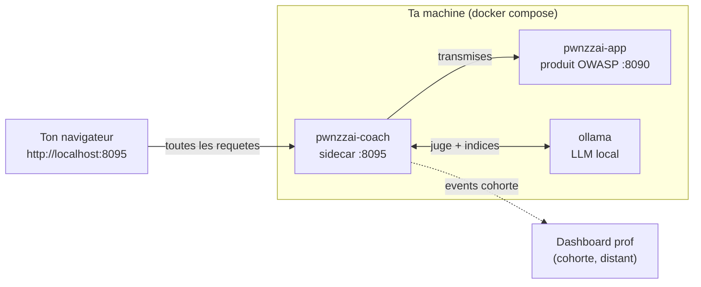

# Guide d'installation eleve — PwnzzAI (Coach JuiceLab)

> Objectif : avoir OWASP PwnzzAI + le Coach JuiceLab fonctionnel sur ton portable en **10 a 15 minutes**, sur `http://localhost:8095`.

> Version anglaise : [STUDENT-INSTALL-EN.md](./STUDENT-INSTALL-EN.md).

---

## 0. Choisis ton mode AVANT d'installer

Il y a **deux modes**. La seule difference est la **remontee de ta progression** vers le dashboard du prof. Lis ce tableau en premier.

| Ta situation | Mode | Ce que tu lances | Le dashboard prof ? |
|---|---|---|---|
| **TD avec un enseignant** (cas normal) | **Cohorte** | La stack PwnzzAI complete ; tes events partent vers le dashboard du prof | **NON, tu ne l'installes PAS.** C'est le prof qui l'heberge. |
| Tu bosses **seul, sans prof** (revision, autonomie) | **Solo** | La stack PwnzzAI complete ; aucune remontee | **NON.** PwnzzAI n'a pas de dashboard eleve : le coach marche en local, sans reporting. |

> **ATTENTION — erreur frequente.** Dans **aucun mode** tu n'installes de dashboard sur ton portable. PwnzzAI n'embarque **aucun dashboard eleve**. En TD (mode cohorte), c'est le prof qui heberge l'unique dashboard central ; toi, tu te contentes de **pointer** dessus avec `-d <ip-prof>` (section 3.2) et de lui demander son **IP**. En solo, il n'y a tout simplement pas de reporting — le coach (indices, juge, quiz, badges) fonctionne quand meme en local.

> Dans les deux modes, la stack lancee chez toi est **identique** (3 conteneurs). Seule la cle `JUICELAB_DASHBOARD_URL` change : renseignee en cohorte, vide en solo.

---

## 1. Ce qui sera installe

PwnzzAI tourne comme **une seule stack `docker compose`** a la racine du depot. Trois conteneurs, toujours les trois, quel que soit le mode :

| Conteneur | Port hote | Role | Mode |
|---|---|---|---|
| `pwnzzai-coach` | **8095** → 8090 | **Entree eleve** : proxy + panneau coach (indices, juge, quiz, badges) | Cohorte **et** Solo |
| `pwnzzai-shop` | 8090 → 8080 | PwnzzAI brut OWASP (intact, pour debug) | Cohorte **et** Solo |
| `ollama` | interne | LLM local : modele des labs + modele du juge/indices (volume `ollama_data`) | Cohorte **et** Solo |



Tu utilises **uniquement** `http://localhost:8095` (le coach). Le port `8090` reste disponible pour deboguer PwnzzAI sans le coach.

Le coach **ne modifie pas** le produit OWASP : il se place devant comme proxy transparent et injecte un `<script>` dans la page.

Le premier `docker compose up --build` construit l'image PwnzzAI (clonee a un commit pinne) : compte **5 a 8 minutes**. Ensuite, chaque demarrage est de l'ordre de **10 secondes**. Apres le premier `up`, il faut **tirer les modeles Ollama** (~2-3 Go de telechargement) — l'installateur s'en charge automatiquement.

En mode cohorte, aucune donnee sensible ne quitte ton portable au-dela des **events de progression** (`session_start`, `hint_revealed`, `challenge_solved`, `journal_filled`, `quiz_completed`, `badge_earned`) envoyes au dashboard prof que tu as designe. En mode solo, rien ne sort.

---

## 2. Prerequis

| Outil | Version minimum | Ou le trouver |
|---|---|---|
| **Docker Desktop** (Windows / macOS) ou **Docker Engine** (Linux) | 24+ | <https://www.docker.com/products/docker-desktop> |
| **Docker Compose v2** | livre avec Docker Desktop ; sur Linux : `sudo apt install docker-compose-v2` (distro) ou `docker-compose-plugin` (dépôt officiel Docker) — voir § Annexe A | — |
| **Git** | n'importe quelle version recente | <https://git-scm.com/downloads> |
| **RAM** | 8 Go libres conseilles (Ollama charge le modele du juge en memoire) | — |
| **Disque** | 6 Go libres (image PwnzzAI + modeles Ollama) | — |

Sanity check rapide :

```bash
docker --version            # Docker version 24.x ou plus
docker compose version      # Docker Compose v2.x ou plus
git --version
```

Si `docker compose version` echoue, ton Docker est trop vieux. Sur Linux : `sudo apt install docker-compose-v2` (Ubuntu/Debian standard) ou `sudo apt install docker-compose-plugin` (dépôt officiel Docker). Sur Windows / macOS : mets a jour Docker Desktop.

> **Note RAM/Ollama.** Le coach utilise un LLM local (Ollama) pour les indices et le juge. Le modele du juge par defaut (`llama3.2:3b`) tient dans ~3-4 Go de RAM ; prevois de la marge. Sur une machine juste, garde le juge en `llama3.2:3b` (ne descends pas a `1b` : verdicts non fiables).

---

## 3. Installation en une commande (recommande)

Meme flux sur Linux, macOS et Windows.

### 3.1 Cloner le repo

```bash
git clone https://github.com/mo0ogly/PwnzzAI.git
cd PwnzzAI
```

### 3.2 Lancer l'installeur

Remplace `M2-IA-2026` par l'identifiant de cohorte que ton enseignant t'a donne, et `192.168.1.10` par l'**IP du dashboard prof** qu'il t'a communiquee. Sans `-c`, le script demande la cohorte de maniere interactive.

#### Mode cohorte — TD avec un enseignant (recommande)

Stack complete, events pousses vers le dashboard du prof. **Tu n'installes pas de dashboard.**

```bash
# Linux / macOS
./scripts/install-student.sh -c M2-IA-2026 -d 192.168.1.10
```

```powershell
# Windows PowerShell 7+
.\scripts\install-student.ps1 -Cohort M2-IA-2026 -Dashboard 192.168.1.10
```

> **Port du dashboard prof.** Defaut `5000`. La valeur de `-d` accepte plusieurs formes : `192.168.1.10` (→ `http://192.168.1.10:5000`), `192.168.1.10:5050` (port explicite), ou une URL complete `http://192.168.1.10:5000`. L'URL d'envoi des events suivra ce que tu donnes.

#### Mode solo — sans prof (autonomie)

Lance la **meme** stack complete, mais sans remontee (`JUICELAB_DASHBOARD_URL` reste vide). Le coach marche en local : indices, juge, quiz, badges fonctionnent, ils ne sont juste pas envoyes a un prof.

```bash
# Linux / macOS
./scripts/install-student.sh -c M2-IA-2026
```

```powershell
# Windows PowerShell 7+
.\scripts\install-student.ps1 -Cohort M2-IA-2026
```

Si le script bash n'est pas executable :

```bash
chmod +x scripts/install-student.sh
```

Si PowerShell se plaint de la politique d'execution, lance une fois :

```powershell
Set-ExecutionPolicy -Scope CurrentUser -ExecutionPolicy RemoteSigned
```

puis recommence.

> **PowerShell 7+ est requis.** Windows 10 a PowerShell 5.1 par defaut, qui est trop vieux. Installe PowerShell 7 depuis <https://learn.microsoft.com/fr-fr/powershell/scripting/install/installing-powershell-on-windows>.

### 3.3 Ce que fait l'installeur

Dans l'ordre :

1. Verifie que Docker et Docker Compose sont disponibles.
2. Cree la racine `.env` depuis `.env.example` si elle n'existe pas encore.
3. Ecrit / met a jour les cles `JUICELAB_*` : `JUICELAB_COHORT_ID` (selon `-c`, la valeur existante, ou un prompt), `JUICELAB_INSTANCE_LABEL` (selon `-l`, ou le nom de la machine), et `JUICELAB_DASHBOARD_URL` (renseigne en cohorte via `-d`, vide en solo). Le **label** est le nom de **ton poste** visible par le prof dans sa matrice de cohorte.
4. Lance la stack complete : `docker compose up -d --build` (les 3 conteneurs).
5. Tire les modeles Ollama (`scripts/pull-models.sh` : le juge d'abord, puis l'assistant des labs).
6. Attend que le coach reponde sur `http://127.0.0.1:8095/__coach/health`, puis affiche les URLs eleve.

L'installeur est **idempotent** : le relancer ne casse rien et ne reecrase pas les valeurs valides deja presentes dans `.env`. Pour une reinstallation propre (efface les volumes, dont les modeles Ollama, et remet les cles eleve aux defauts), ajoute `--reset` (bash) ou `-Reset` (PowerShell).

### 3.4 Autres modes

| Commande | Effet |
|---|---|
| `./scripts/install-student.sh -c COHORTE -d IP_PROF[:PORT]` | **mode cohorte** : stack complete, events vers le dashboard prof a `IP_PROF` (port `5000` par defaut, `:5050` ou autre si precise) |
| `./scripts/install-student.sh -c COHORTE` | **mode solo** : stack complete, aucune remontee |
| `./scripts/install-student.sh` | interactif, demande le `cohort_id` (mode solo) |
| `./scripts/install-student.sh -y` | non interactif, accepte tous les defauts (cohorte = `M2-IA-2026`, mode solo) |
| `./scripts/install-student.sh -l mon-poste` | fixe le label de ton poste dans la matrice prof |
| `./scripts/install-student.sh --reset` | `docker compose down -v` + reinstall complet (efface les volumes, dont `ollama_data`) |
| `.\scripts\install-student.ps1 -Yes` | idem, PowerShell |
| `.\scripts\install-student.ps1 -Reset` | idem, PowerShell |

---

## 4. Verifier l'installation

Ouvre ces URLs dans ton navigateur :

| URL | Attendu |
|---|---|
| <http://localhost:8095> | PwnzzAI servi **via le coach** (entree eleve). Un bouton rond violet **« JL »** apparait en bas a droite. |
| <http://localhost:8090> | PwnzzAI **brut** OWASP (sans coach, pour debug). |
| `http://localhost:8095/__coach/health` | JSON `{"ok":true,"ollama":true,"dashboard_configured":...}` |

La sante du coach se lit ligne de commande :

```bash
curl -s http://localhost:8095/__coach/health
# {"ok":true,"ollama":true,"dashboard_configured":true}
```

- `ollama:true` → un modele de juge est tire et disponible (sinon, voir § 6).
- `dashboard_configured:true` → la remontee vers le dashboard prof est activee (mode cohorte). En **mode solo** c'est `false`, et c'est **normal**.

> **Dashboard prof injoignable a l'installation ?** Aussi normal si le prof n'a pas encore lance son dashboard, ou si tu n'es pas sur le meme reseau. L'installation est quand meme reussie : les events seront pousses des que le dashboard sera disponible. (Le coach vise l'URL du dashboard **depuis le conteneur**, pas depuis ton navigateur.)

> **Le panneau coach est FERME au depart.** Il n'apparait pas tout seul. Pour l'ouvrir :
>
> 1. Clique le **bouton rond violet « JL »** en bas a droite de la page.
> 2. Ou ajoute **`#coach`** a la fin de l'URL d'un lab, ex. `http://localhost:8095/direct-prompt-injection#coach` — le panneau s'ouvre automatiquement.
>
> Verifie que tu es bien sur le port **8095** (le coach), pas `8090` (l'app brute). Si rien n'apparait : recharge avec `Ctrl+Shift+R`.

Smoke test bout-en-bout :

1. Ouvre `http://localhost:8095` et cree un compte / connecte-toi dans PwnzzAI comme d'habitude.
2. Navigue vers un lab (ex. *Direct Prompt Injection*).
3. Clique le bouton **« JL »** : le **panneau coach a onglets** s'ouvre (bouton FR/EN pour la langue).
4. Onglet **Indices** : revele l'indice **N1** (coût −5 %). Le texte doit s'afficher (genere par le LLM local). Si tu lis « Service coach indisponible (Ollama) », les modeles ne sont pas tires → § 6.
5. Attaque l'assistant du lab (la conversation est capturee automatiquement), puis onglet **Progression** → **Verifier ma reussite** : le **juge** rend un verdict *Reussi / Partiel / Pas encore* + score + justification.
6. En **mode cohorte**, demande a ton prof si ta ligne apparait dans sa matrice de cohorte (colonne = ton label).

Le panneau coach ouvert (onglets Briefing / Indices / Journal / Quiz / Progression) :


> **Deux identites distinctes**
>
> | Identifiant | Origine | Role |
> |---|---|---|
> | **Label** (`-l mon-poste`) | `.env`, defini a l'install | Identifie **ton poste** dans la matrice du prof — fixe, independant de PwnzzAI |
> | **Compte PwnzzAI** | Compte que tu crees dans l'app | Te connecte au produit OWASP — distinct du label |
>
> Le prof voit la colonne de ton **label** dans sa matrice de cohorte ; il n'a pas besoin de ton compte PwnzzAI.

### Comment ta reussite arrive chez le prof (mode cohorte)

Tu n'envoies **rien a la main** : le coach s'en charge. En trois temps.

1. **Inscris-toi a la cohorte (une fois).** Dans le panneau coach, bloc
   **« Rejoins ta cohorte (pour que le prof te suive) »** : saisis **ton email**
   et clique **« Rejoindre la cohorte »**. Ton statut passe a **« En attente
   d'approbation du prof »**, puis a **« Inscrit »** une fois que le prof a valide
   ta demande cote dashboard. L'email est l'**identite** que le prof voit dans sa
   liste (en plus du label de ton poste).

2. **Valide un lab.** Apres avoir attaque l'assistant, onglet **Progression** →
   **« Verifier ma reussite »**. Si le **juge** rend *Reussi*, le coach **pousse
   automatiquement** un evenement `challenge_solved` vers le dashboard du prof
   (POST interne `/api/sync`). Aucune action de plus de ta part.

3. **Recupere ta preuve signee (optionnel).** Une fois le `challenge_solved`
   recu, le dashboard **signe** une preuve (HMAC-SHA256). Bouton **« Telecharger
   la preuve »** : tu obtiens un fichier markdown signe par le serveur (la preuve
   n'existe **que** si le dashboard a bien recu ta reussite — sinon « Preuve
   indisponible »).

> **Rien ne part sans dashboard.** En **mode solo** (pas de `-d`), il n'y a ni
> inscription ni envoi : `challenge_solved` reste local, et « Telecharger la
> preuve » n'est pas disponible. La securite est cote serveur : la cohorte et la
> signature sont gerees par le dashboard, un eleve ne peut pas falsifier la preuve
> d'un autre depuis son navigateur.

Si quelque chose echoue, voir § 6 ci-dessous.

---

## 5. Utilisation au quotidien

Une fois installe, tu n'as **pas** besoin de relancer l'installeur. La stack survit aux reboots. Le plus simple est le launcher `pwnzzai.sh` (Linux/macOS) ou `pwnzzai.ps1` (Windows) :

```bash
# Linux / macOS — launcher
./pwnzzai.sh up         # demarre / reprend la stack (build + up -d)
./pwnzzai.sh down       # arrete (conserve les volumes)
./pwnzzai.sh restart    # down puis up
./pwnzzai.sh status     # docker compose ps
./pwnzzai.sh logs       # logs en direct (coach|app|ollama|all)
./pwnzzai.sh health     # ping coach (JSON) + brut (code HTTP)
./pwnzzai.sh models     # (re)tire les modeles Ollama
./pwnzzai.sh wipe       # DESTRUCTIF : down -v (supprime ollama_data)
```

```powershell
# Windows PowerShell 7+
.\pwnzzai.ps1 up | down | restart | status | logs | health | models | wipe
```

Equivalent direct avec `docker compose` (depuis la racine du depot) :

```bash
docker compose up -d        # demarrer / reprendre
docker compose down         # arreter (conserve les volumes)
docker compose logs -f      # logs en direct
docker compose down -v      # reset complet (efface ollama_data : re-tirage des modeles requis)
```

Ta progression coach (jeton, scores, indices, journaux, quiz, badges) est stockee **cote navigateur** dans `localStorage` (cle `pwnzzai_coach_v1`). Elle survit aux redemarrages de conteneurs. Un `docker compose down -v` (ou `./pwnzzai.sh wipe`) efface le volume `ollama_data` : il faudra **re-tirer les modeles** (`./pwnzzai.sh models`).

### Optionnel : utiliser un LLM cloud pour la cible

Par defaut l'assistant cible tourne sur **Ollama local** (hors-ligne). Si tu preferes un fournisseur cloud (plus rapide, plus fiable), tu peux le basculer dans `.env` — le produit OWASP utilise **LiteLLM**, donc aucune modif de code n'est necessaire. `MODEL_PROVIDER=openai` signifie juste « cloud via LiteLLM » ; le prefixe avant le `/` dans `LITELLM_MODEL` choisit le vrai fournisseur.

| Fournisseur | `MODEL_PROVIDER` | `LITELLM_MODEL` (exemple) | Variable de cle |
|---|---|---|---|
| Ollama (local, defaut) | `ollama` | — (utilise `OLLAMA_MODEL`) | — |
| Groq (recommande) | `openai` | `groq/llama-3.3-70b-versatile` | `GROQ_API_KEY` |
| OpenAI | `openai` | `openai/gpt-4o-mini` | `OPENAI_API_KEY` |
| Google Gemini | `openai` | `gemini/gemini-2.0-flash` | `GEMINI_API_KEY` |
| Anthropic | `openai` | `anthropic/claude-3-5-haiku-latest` | `ANTHROPIC_API_KEY` |

Mets ces trois lignes dans `.env` (exemple Groq), puis relance avec `./pwnzzai.sh restart` :

```ini
MODEL_PROVIDER=openai
LITELLM_MODEL=groq/llama-3.3-70b-versatile
GROQ_API_KEY=gsk_xxx
```

Seuls les labs cloud `openai_*` utilisent ceci ; les labs `ollama_*` utilisent toujours Ollama local, donc garde le service `ollama` actif. Ta cle reste dans `.env` (gitignore) — ne la committe jamais.

> **Si la cible reste sur Ollama malgre la config Groq** : dans l'interface du
> lab, choisis bien l'option **cloud** (le bouton/onglet du fournisseur). Les
> pages web envoient le fournisseur explicitement ; un appel API brut sans ce
> choix retombe sur Ollama (le defaut interne reste `auto`). Detail connu du
> produit OWASP — voir [UPSTREAM-NOTES.md](./UPSTREAM-NOTES.md).
>
> **Reponses vides en cloud** : evite `groq/openai/gpt-oss-20b` — c'est un modele
> *reasoning* qui renvoie souvent du vide (teste : `HTTP 500` / `response:""` sur
> certains labs). Reste sur `groq/llama-3.3-70b-versatile` (non-reasoning, fiable).
>
> **Verifier que la cle est valide** : une cle Groq commence par `gsk_`. Test rapide :
> `curl -s -o /dev/null -w "%{http_code}\n" https://api.groq.com/openai/v1/models -H "Authorization: Bearer gsk_..."` doit renvoyer `200` (un `401` = cle invalide).

---

## 6. Depannage

### Indice / « Verifier ma reussite » affiche « Service coach indisponible (Ollama) »

Cause la plus frequente : les **modeles Ollama ne sont pas tires** (volume neuf). Tant qu'ils manquent, les indices et le juge sont indisponibles. Solution :

```bash
./pwnzzai.sh models          # ou : scripts/pull-models.sh
```

Puis verifie : `curl -s http://localhost:8095/__coach/health` doit montrer `"ollama":true`.

### `health` renvoie `"ollama":false`

Idem : aucun modele de juge disponible. Lance `./pwnzzai.sh models`. Si ca persiste, verifie que le conteneur `ollama` tourne (`./pwnzzai.sh status`) et que `COACH_JUDGE_MODEL` dans `.env` est un modele valide (defaut `llama3.2:3b`).

### Port deja utilise (`8090` ou `8095`)

Une autre appli squatte le port. Soit tu l'arretes, soit tu changes le mapping hote dans `docker-compose.yml` (`"8095:8090"` / `"8090:8080"`) et tu relances (`./pwnzzai.sh restart`).

### `docker compose: command not found`

Ton Docker est trop vieux ou le plugin Compose est manquant.
- Linux (Ubuntu/Debian standard) : `sudo apt install docker-compose-v2`
- Linux (dépôt officiel Docker) : `sudo apt install docker-compose-plugin`
- Windows / macOS : mets a jour Docker Desktop.

> **Note :** les deux paquets sont mutuellement exclusifs — n'installe pas les deux. Sur Ubuntu 25.04 et plus, utilise `docker-compose-v2`.

### `permission denied` sur le script (Linux / macOS)

```bash
chmod +x scripts/install-student.sh
chmod +x pwnzzai.sh
```

### PowerShell : *"l'execution de scripts est desactivee sur ce systeme"*

Une fois par utilisateur :

```powershell
Set-ExecutionPolicy -Scope CurrentUser -ExecutionPolicy RemoteSigned
```

> **PowerShell 7+ requis.** Les scripts `.ps1` ne sont pas garantis sous PowerShell 5.1 (Windows 10 par defaut). Installe PowerShell 7 : <https://learn.microsoft.com/fr-fr/powershell/scripting/install/installing-powershell-on-windows>.

### Premier build long / lourd

Le premier `up --build` clone et construit l'image PwnzzAI (5 a 8 min) puis telecharge les modeles Ollama (~2-3 Go). C'est normal et ca n'arrive **qu'une fois** : les builds suivants prennent ~10 s et les modeles restent dans le volume `ollama_data`.

### Mode cohorte : « Dashboard prof injoignable »

Normal cote eleve dans plusieurs cas : le prof n'a pas encore lance son dashboard, vous n'etes pas sur le meme reseau (LAN plat requis), ou un firewall bloque le port (defaut `5000`). **C'est cote prof / reseau** que ca se regle — tu n'as **pas** de dashboard local a corriger. L'install reste reussie ; les events partiront des que le dashboard sera joignable. Rappelle a ton prof l'URL/IP attendue (`-d <ip-prof>`).

### `dashboard_configured:false` alors que je suis en cohorte

`JUICELAB_DASHBOARD_URL` est vide dans `.env`. Relance l'installeur avec `-d <ip-prof>` (mode cohorte). En **solo**, `false` est attendu.

### Les conteneurs sont en crash-loop

```bash
./pwnzzai.sh logs coach      # ou : app | ollama
# equivalent : docker compose logs --tail=200 pwnzzai-coach
```

Envoie les 50 dernieres lignes du conteneur en faute a ton enseignant.

---

## 7. Desinstaller

```bash
# depuis la racine du depot
./pwnzzai.sh wipe              # ou : docker compose down -v  (arret + suppression des volumes)
cd ..
rm -rf PwnzzAI                 # suppression du repo clone
docker image prune            # optionnel, libere du disque
```

`wipe` / `down -v` supprime le volume `ollama_data` : tous les modeles tires sont perdus (re-telechargement au prochain `up` + `models`).

---

## 8. Ou demander de l'aide

- Ouvre une issue sur <https://github.com/mo0ogly/PwnzzAI/issues> avec :
  - ton OS + version de Docker Desktop
  - la sortie de `curl -s http://localhost:8095/__coach/health`
  - les 50 dernieres lignes de `./pwnzzai.sh logs` (ou `docker compose logs`)
  - la commande exacte qui a echoue et la sortie complete

Ton enseignant est ton premier point de contact pour tout ce qui concerne la cohorte et le dashboard prof.

---

## Annexe A — Installer Docker et Docker Compose sur Linux

Deux méthodes **mutuellement exclusives**. Choisis l'une OU l'autre.

### Méthode A — paquets de la distribution (recommandée pour un TD)

```bash
sudo apt update
sudo apt install -y docker-compose-v2
sudo usermod -aG docker $USER
newgrp docker   # ou se déconnecter puis se reconnecter
docker compose version
```

`docker-compose-v2` tire `docker.io` comme dépendance : une seule commande installe tout. C'est le choix pragmatique pour un poste étudiant — la fraîcheur de version ne compte pas ici.

### Méthode B — dépôt officiel Docker (si tu veux la dernière version)

```bash
# Configurer le dépôt officiel : https://docs.docker.com/engine/install/ubuntu/
sudo apt install -y docker-ce docker-ce-cli containerd.io \
    docker-buildx-plugin docker-compose-plugin
sudo usermod -aG docker $USER
newgrp docker
docker compose version
```

> **Piège :** si tu as déjà installé la méthode A, purge-la d'abord : `sudo apt remove docker-compose-v2 docker.io`

### Vérification (commune)

```bash
docker run --rm hello-world
docker compose version
```

### Note arm64 (Apple Silicon / Snapdragon)

Sur les machines arm64 (Qualcomm X1E, Apple M1/M2/M3), un build Docker peut échouer avec `E: Dynamic MMap ran out of room`. C'est un bug connu : la liste des paquets Debian est trop volumineuse pour le cache APT par défaut. Le `Dockerfile` du projet intègre déjà le correctif (`APT::Cache-Start "100663296"`). Si tu rencontres cette erreur sur un autre Dockerfile, la solution est :

```dockerfile
RUN printf 'APT::Cache-Start "100663296";\n' > /etc/apt/apt.conf.d/70cache \
 && apt-get update \
 && apt-get install -y --no-install-recommends <paquet> \
 && rm -rf /var/lib/apt/lists/* /etc/apt/apt.conf.d/70cache
```
